# Planning Document — Himmapun Retreat Hotel Operations App

## Status: Ready to build
**Last updated:** 2026-03-18

---

## Table of Contents

1. [Decisions Summary](#decisions-summary)
2. [Tech Stack](#tech-stack)
3. [Architecture](#architecture)
4. [Database Design](#database-design)
5. [Sequence Diagrams](#sequence-diagrams)
6. [User Journeys](#user-journeys)
7. [Project Structure](#project-structure)
8. [Milestones & Working Packages](#milestones--working-packages)
9. [Setup Instructions](#setup-instructions)
10. [Decisions Log](#decisions-log)

---

## Decisions Summary

| Question | Decision |
|----------|----------|
| Framework | Next.js (App Router) |
| Hosting | Vercel |
| Database | Supabase (PostgreSQL) |
| Auth | Supabase Auth (individual accounts, single role) |
| AI booking intake | Claude Code `/new-booking` slash command (owner's machine only) |
| Styling | TailwindCSS |
| Real-time sync | Not needed — page refresh acceptable |
| Mobile | Responsive web app (not PWA) |
| Data migration | Deferred — start with clean database |

---

## Tech Stack

### Next.js (App Router)
- Full-stack: UI and API routes in one project
- Vercel-native — zero-config deployment
- File-based routing maps naturally to the 6 panels
- API Routes keep the Anthropic key server-side

### Supabase
- Managed PostgreSQL — no server to run
- Built-in Auth with email/password (individual staff accounts)
- Free tier is sufficient for this property's scale
- Dashboard UI makes it easy to inspect and edit data directly
- Row Level Security (RLS) enforces auth at the database level

### AI Booking Intake — Claude Code Slash Command
- Handled entirely outside the app via `.claude/commands/new-booking.md`
- Owner pastes OTA screenshot into Claude Code, types `/new-booking`
- Claude extracts fields, shows confirmation table, inserts directly into Supabase
- Uses `SUPABASE_SERVICE_ROLE_KEY` in `.env.local` on owner's machine — never in the app or Vercel
- No Anthropic API key needed in the app

### TailwindCSS
- Utility-first, responsive by default
- Custom dark design tokens configured in `tailwind.config.ts`

---

## Architecture

### System Architecture

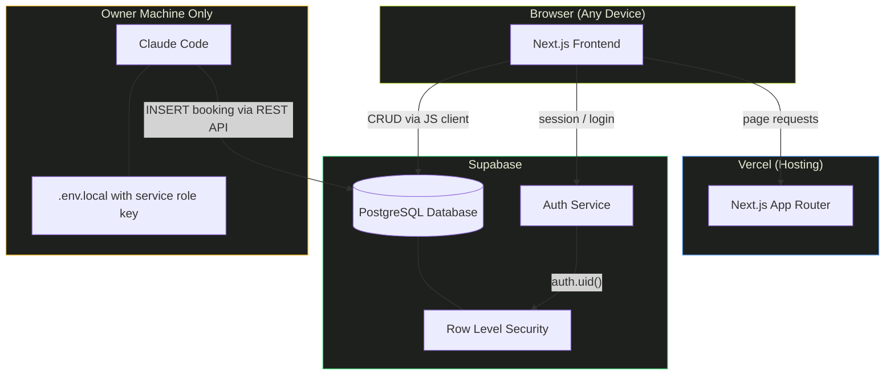

### Deployment Pipeline

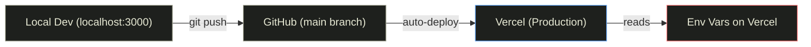

---

## Database Design

### Entity Relationship Diagram

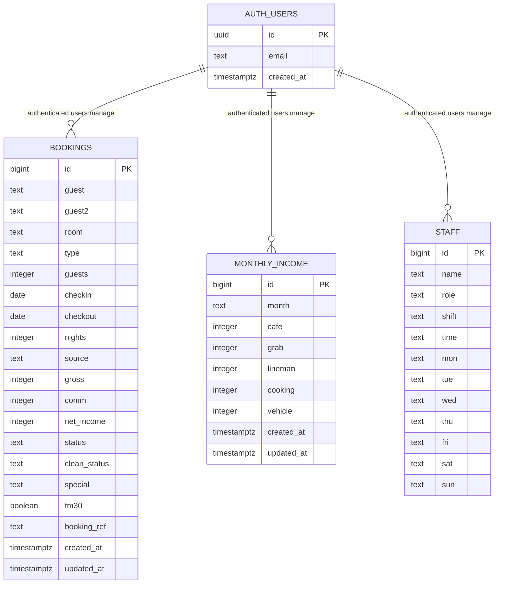

### Table Definitions (SQL)

#### `bookings`
```sql
create table bookings (
  id           bigserial primary key,
  guest        text        not null,
  guest2       text,
  room         text        not null,
  type         text        not null,   -- Standard | Tent | Bungalow | Extra
  guests       integer     not null default 1,
  checkin      date        not null,
  checkout     date        not null,
  nights       integer     not null,   -- auto-calculated on save
  source       text        not null,   -- Direct | Booking.com | Agoda | Airbnb | Other
  gross        integer     not null default 0,
  comm         integer     not null default 0,
  net_income   integer     not null,   -- auto-calculated: gross - comm
  status       text        not null,   -- Upcoming | Check-in | Occupied | Checkout | Completed
  clean_status text        not null default '🟢 Clean',
  special      text,
  tm30         boolean     not null default false,
  booking_ref  text,
  created_at   timestamptz default now(),
  updated_at   timestamptz default now()
);

-- Row Level Security
alter table bookings enable row level security;
create policy "Authenticated users only" on bookings
  for all using (auth.role() = 'authenticated');
```

#### `monthly_income`
```sql
create table monthly_income (
  id        bigserial primary key,
  month     text    not null unique,  -- e.g. "Jan 2026"
  cafe      integer not null default 0,
  grab      integer not null default 0,
  lineman   integer not null default 0,
  cooking   integer not null default 0,
  vehicle   integer not null default 0,
  created_at timestamptz default now(),
  updated_at timestamptz default now()
);

alter table monthly_income enable row level security;
create policy "Authenticated users only" on monthly_income
  for all using (auth.role() = 'authenticated');
```

#### `staff`
```sql
create table staff (
  id    bigserial primary key,
  name  text not null,
  role  text not null,   -- Front Desk | Housekeeping | Maintenance | Security
  shift text not null,   -- Morning | Evening | Night
  time  text,            -- e.g. "07:00–15:00"
  mon   text default 'Off',
  tue   text default 'Off',
  wed   text default 'Off',
  thu   text default 'Off',
  fri   text default 'Off',
  sat   text default 'Off',
  sun   text default 'Off'
);

alter table staff enable row level security;
create policy "Authenticated users only" on staff
  for all using (auth.role() = 'authenticated');
```

---

## Sequence Diagrams

### 1. Login Flow

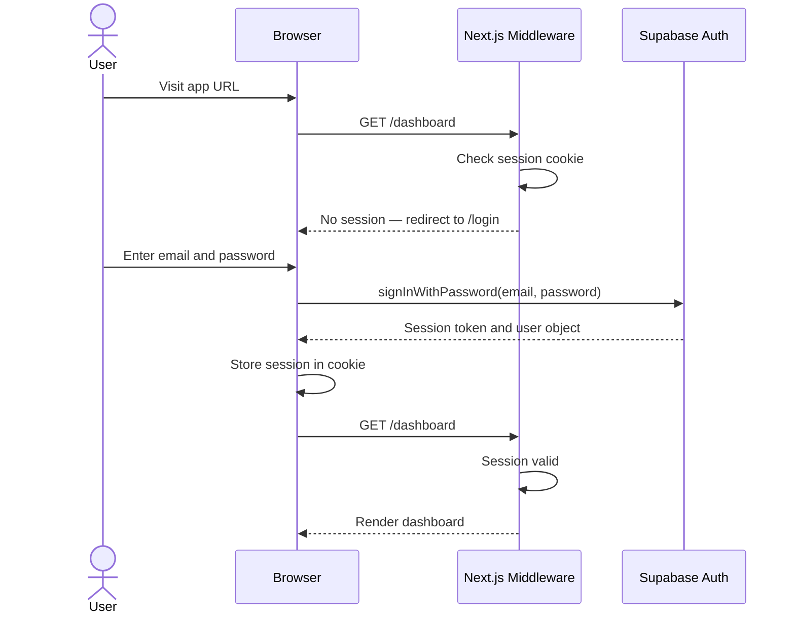

### 2. Manual Booking Creation

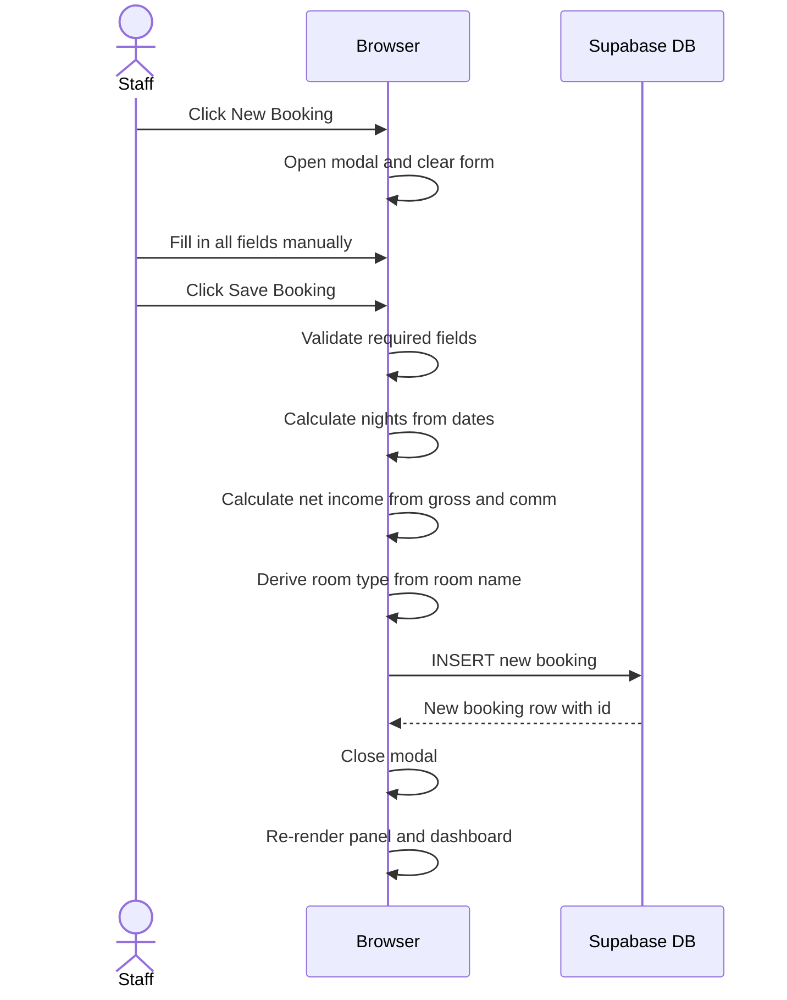

### 3. AI Screenshot Booking

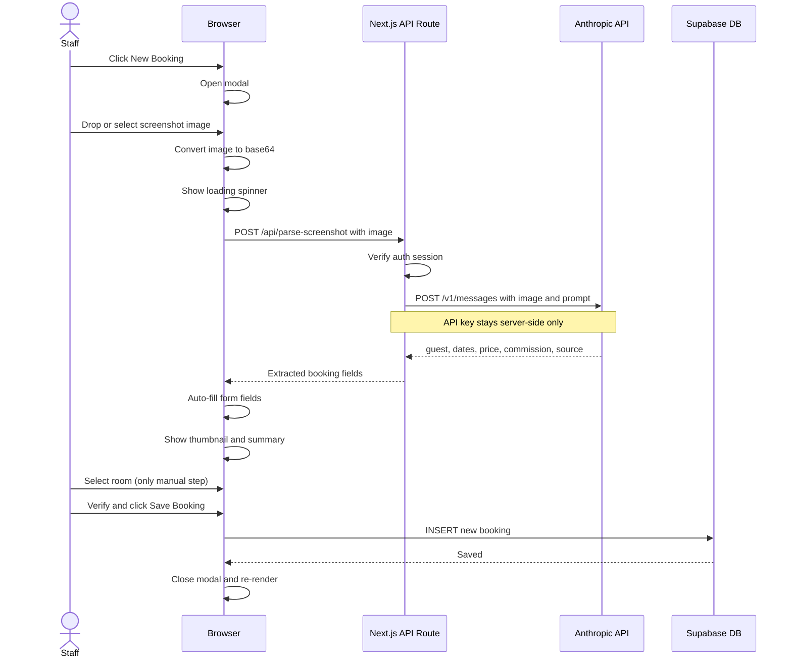

### 4. Inline Clean Status Update

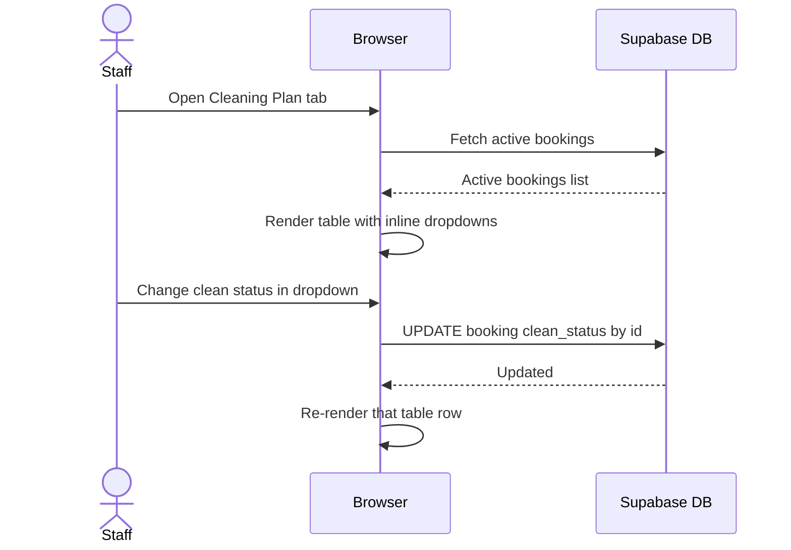

### 5. Vercel Deployment

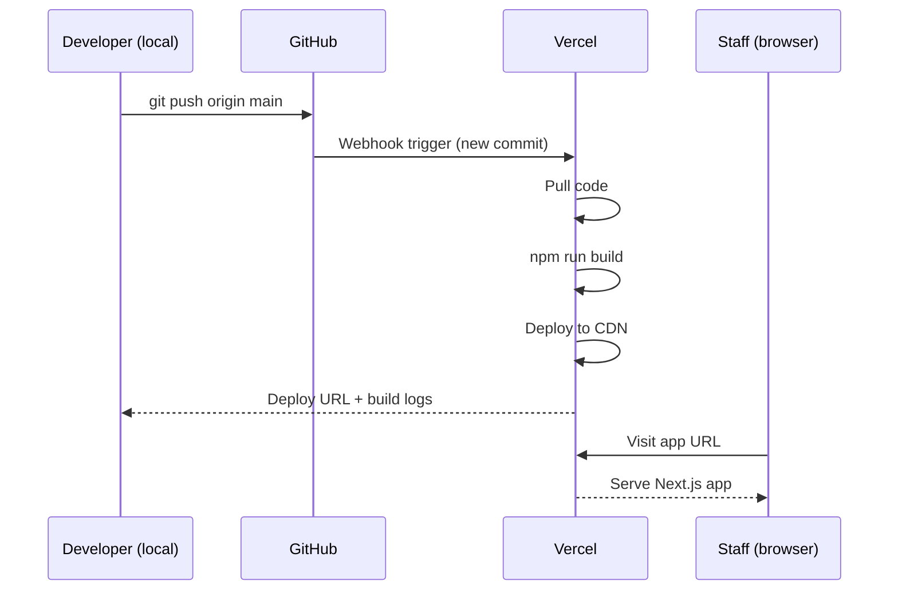

---

## User Journeys

### Journey 1 — Owner: Morning Review

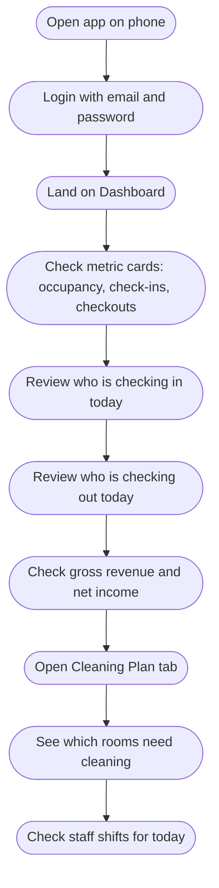

### Journey 2 — Staff: Add a New Booking from OTA Screenshot

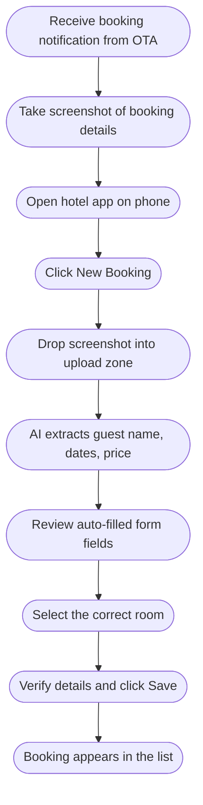

### Journey 3 — Housekeeping: Cleaning Workflow

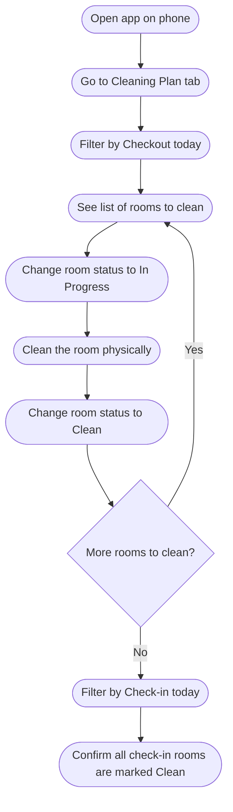

### Journey 4 — Owner: Monthly Reporting

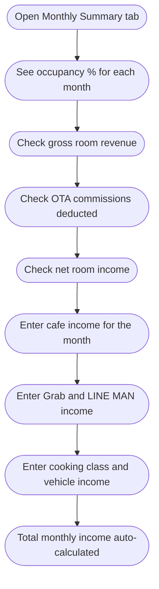

---

## Project Structure

```
/
├── src/
│   ├── app/
│   │   ├── layout.tsx                Root layout (fonts, Supabase provider)
│   │   ├── page.tsx                  Redirect → /dashboard
│   │   ├── login/
│   │   │   └── page.tsx              Email + password login form
│   │   ├── dashboard/
│   │   │   └── page.tsx              Metric cards, weekly grid, room status
│   │   ├── day-guest/
│   │   │   └── page.tsx              Room × date grid
│   │   ├── bookings/
│   │   │   └── page.tsx              Full booking list with filters
│   │   ├── cleaning/
│   │   │   └── page.tsx              Room cleaning status table
│   │   ├── shifts/
│   │   │   └── page.tsx              Staff weekly rota
│   │   ├── monthly/
│   │   │   └── page.tsx              Monthly income summary
│   │
│   ├── components/
│   │   ├── layout/
│   │   │   ├── Sidebar.tsx           Nav links, logo, date badge
│   │   │   └── Topbar.tsx            Page title, + New Booking button
│   │   ├── bookings/
│   │   │   ├── BookingModal.tsx      New / edit booking form
│   │   │   └── ScreenshotUpload.tsx  Drag-and-drop upload zone
│   │   ├── dashboard/
│   │   │   ├── MetricCards.tsx       6 stat cards
│   │   │   ├── WeeklyGrid.tsx        7-day occupancy grid
│   │   │   └── OccupancyByRoom.tsx   Per-room guest dots
│   │   └── ui/
│   │       ├── Badge.tsx             Room type, status, source badges
│   │       └── StatusDropdown.tsx    Inline clean status selector
│   │
│   ├── lib/
│   │   ├── supabase/
│   │   │   ├── client.ts             Browser Supabase client
│   │   │   └── server.ts             Server Supabase client (API routes)
│   │   ├── constants.ts              ROOMS, ROOM_TYPES, OCC_ROOMS, SOURCES
│   │   └── helpers.ts                fmtDate, fmtMoney, calcNights, isStayingOn
│   │
│   └── middleware.ts                 Auth session check on all routes
│
├── .env.local                        Local secrets (never committed)
│                                     Includes SUPABASE_SERVICE_ROLE_KEY for /new-booking skill
├── .env.example                      Template with key names only
├── tailwind.config.ts                Design tokens (colors, fonts)
├── next.config.ts                    Next.js config
└── .claude/commands/
    └── new-booking.md                /new-booking slash command for screenshot intake
```

---

## Milestones & Working Packages

### Overview

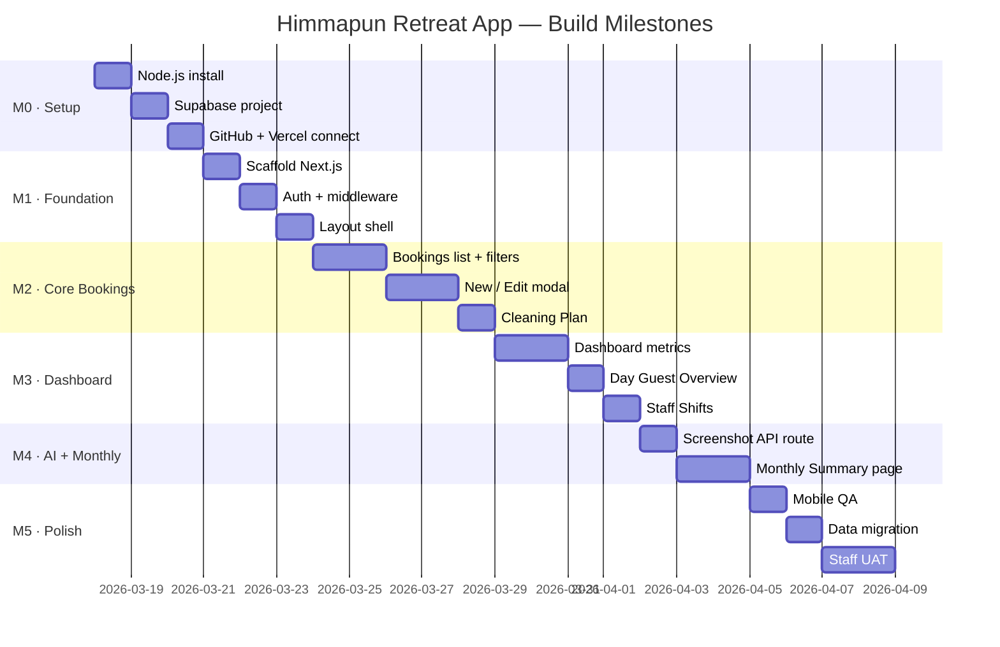

---

### M0 — Infrastructure Setup
**Goal:** All external services created and connected before any code is written.

| # | Task | How |
|---|------|-----|
| M0.1 | Install Node.js | See [Setup Instructions → Step 1](#step-1-install-nodejs) |
| M0.2 | Create Supabase project | See [Setup Instructions → Step 2](#step-2-create-supabase-project) |
| M0.3 | Create Vercel account + connect GitHub repo | See [Setup Instructions → Step 3](#step-3-connect-vercel) |
| M0.4 | Add `SUPABASE_SERVICE_ROLE_KEY` to `.env.local` | See [Setup Instructions → Step 4](#step-4-configure-environment-variables) |

**Done when:** `node -v` returns a version, Supabase project exists, Vercel is connected to the GitHub repo, and `.env.local` contains both Supabase keys.

---

### M1 — Foundation
**Goal:** A running Next.js app deployed on Vercel with login working.

| # | Task |
|---|------|
| M1.1 | Scaffold Next.js project in repo root |
| M1.2 | Configure Tailwind with design tokens (colors, fonts) |
| M1.3 | Install Supabase + Anthropic packages |
| M1.4 | Create Supabase DB tables + RLS policies (copy SQL from this doc) |
| M1.5 | Create `.env.local` with Supabase + Anthropic keys |
| M1.6 | Build login page (`/login`) |
| M1.7 | Add `middleware.ts` to protect all routes |
| M1.8 | Build sidebar + topbar layout shell |
| M1.9 | Deploy to Vercel + add env vars in Vercel dashboard |
| M1.10 | Create first staff account in Supabase Auth dashboard |

**Done when:** Staff can log in at the Vercel URL, see the layout shell, and log out.

---

### M2 — Core Booking Features
**Goal:** Staff can create, view, edit, delete bookings and update clean status.

| # | Task |
|---|------|
| M2.1 | All Bookings page — table with all rows from Supabase |
| M2.2 | Status, room, source filter dropdowns |
| M2.3 | Date range filter (overlap logic) |
| M2.4 | "+ New Booking" modal — manual entry form |
| M2.5 | Auto-calculate nights + net income on form |
| M2.6 | Save new booking to Supabase |
| M2.7 | Edit existing booking (pre-fill modal) |
| M2.8 | Delete booking with confirmation |
| M2.9 | Cleaning Plan page — all 12 rooms always shown |
| M2.10 | Inline clean status dropdown — updates Supabase immediately |

**Done when:** A booking can be created, edited, deleted, and its clean status updated — all reflected in Supabase.

---

### M3 — Dashboard & Views
**Goal:** The three read-heavy views are working with live data.

| # | Task |
|---|------|
| M3.1 | Dashboard — 6 metric cards (occupancy, guests, check-ins, checkouts, gross, net) |
| M3.2 | Dashboard — "Checking in today" cards |
| M3.3 | Dashboard — "Checking out today" cards |
| M3.4 | Dashboard — Upcoming check-ins table (next 7 days) |
| M3.5 | Dashboard — Weekly occupancy grid (OCC_ROOMS only) |
| M3.6 | Dashboard — Income summary + source breakdown |
| M3.7 | Dashboard — Occupancy by room (guest dots) |
| M3.8 | Day Guest Overview — room × date grid with date selector |
| M3.9 | Staff Shifts — today's shift cards + weekly rota table |

**Done when:** The dashboard reflects live Supabase data and all three pages render correctly on mobile.

---

### M4 — Monthly Summary & Slash Command
**Goal:** Monthly report is complete and the `/new-booking` slash command is tested end-to-end.

| # | Task |
|---|------|
| M4.1 | Monthly Summary page — room income columns from bookings |
| M4.2 | Monthly other income columns — manually entered per month |
| M4.3 | Totals row at bottom of monthly table |
| M4.4 | Add `SUPABASE_SERVICE_ROLE_KEY` to `.env.local` |
| M4.5 | Test `/new-booking` with a real OTA screenshot |
| M4.6 | Verify the inserted booking appears correctly in the app |

**Done when:** Monthly summary shows correct occupancy % and totals, and pasting a screenshot and typing `/new-booking` successfully saves a booking to Supabase.

---

### M5 — Polish, Migration & Launch
**Goal:** App is production-ready and all Google Sheets data is imported.

| # | Task |
|---|------|
| M5.1 | Mobile responsive QA — test all pages on iPhone |
| M5.2 | Export bookings from Google Sheets as CSV |
| M5.3 | Clean CSV — map columns to DB schema, fix date formats |
| M5.4 | Import CSV via Supabase dashboard |
| M5.5 | Verify row counts + spot-check data |
| M5.6 | Create all staff accounts in Supabase Auth |
| M5.7 | User acceptance testing with staff |
| M5.8 | Fix any bugs found during UAT |

**Done when:** All staff can log in, existing booking history is visible, and the app is the primary tool replacing Google Sheets.

---

## Setup Instructions

### Step 1: Install Node.js

Node.js is the runtime required to run the project locally.

**Option A — via nvm (recommended for Mac):**
```bash
# Install nvm
curl -o- https://raw.githubusercontent.com/nvm-sh/nvm/v0.39.7/install.sh | bash

# Close and reopen your terminal, then:
nvm install --lts

# Verify — both should print version numbers
node -v
npm -v
```

**Option B — direct installer:**
Go to https://nodejs.org → download the **LTS** version for macOS → run the `.pkg` installer.

---

### Step 2: Create Supabase Project

1. Go to https://supabase.com and sign up (free)
2. Click **New Project**
3. Fill in:
   - **Name:** `himmapun-retreat`
   - **Database password:** choose a strong password and save it somewhere safe
   - **Region:** Southeast Asia (Singapore) — closest to Chiang Mai
4. Click **Create new project** and wait ~2 minutes for provisioning
5. Once ready, go to **Project Settings → API**
6. Copy and save these two values — you will need them later:
   - **Project URL** (looks like `https://xxxx.supabase.co`)
   - **anon / public key** (long string starting with `eyJ...`)
7. Go to **SQL Editor** in the sidebar
8. Paste and run the three `CREATE TABLE` + `ALTER TABLE` (RLS) SQL blocks from the [Database Design](#database-design) section above
9. Verify the three tables appear under **Table Editor**

---

### Step 3: Connect Vercel

1. Go to https://vercel.com and sign up with your GitHub account
2. Click **Add New → Project**
3. Find and select the `expample` GitHub repository
4. Under **Framework Preset**, select **Next.js** (auto-detected)
5. Do **not** deploy yet — click **Environment Variables** first
6. Add these two variables (from Supabase → Project Settings → API):
   ```
   NEXT_PUBLIC_SUPABASE_URL       = (your Supabase Project URL)
   NEXT_PUBLIC_SUPABASE_ANON_KEY  = (your Supabase anon key)
   ```
   Note: `SUPABASE_SERVICE_ROLE_KEY` is **not** added to Vercel — it lives only in `.env.local` on your machine for the `/new-booking` slash command.
7. Click **Deploy** — the first deploy will fail (no Next.js app yet), that is fine
8. Note your app URL (e.g. `https://expample.vercel.app`) — this is where the app will live

---

### Step 4: Get Supabase Service Role Key

This key is only needed for the `/new-booking` slash command on your local machine — it is never added to Vercel.

1. Go to your Supabase project dashboard
2. Click **Project Settings → API**
3. Under **Project API keys**, find the `service_role` key (marked "secret")
4. Copy it — add it to `.env.local` in Step 6 as `SUPABASE_SERVICE_ROLE_KEY`

> **Important:** This key bypasses Row Level Security. Never commit it to git. Never add it to Vercel.

---

### Step 5: Scaffold the Next.js Project

From the repo root in your terminal:

```bash
# Create the Next.js app (answer "Yes" to all prompts)
npx create-next-app@latest . \
  --typescript \
  --tailwind \
  --eslint \
  --app \
  --src-dir \
  --import-alias "@/*" \
  --no-git

# Install Supabase packages
npm install @supabase/supabase-js @supabase/ssr
```

---

### Step 6: Configure Environment Variables

Create a `.env.local` file in the project root:

```bash
# .env.local — never commit this file
NEXT_PUBLIC_SUPABASE_URL=https://your-project-id.supabase.co
NEXT_PUBLIC_SUPABASE_ANON_KEY=eyJhbGciOiJIUzI1NiIsInR5cCI6IkpXVCJ9...
SUPABASE_SERVICE_ROLE_KEY=eyJ...   # for /new-booking slash command only
```

Also create a `.env.example` file (safe to commit — no real values):

```bash
# .env.example — copy to .env.local and fill in your values
NEXT_PUBLIC_SUPABASE_URL=
NEXT_PUBLIC_SUPABASE_ANON_KEY=
SUPABASE_SERVICE_ROLE_KEY=
```

Make sure `.env.local` is in `.gitignore` (Next.js adds it by default).

---

### Step 7: Run Locally

```bash
npm run dev
```

Open http://localhost:3000 — you should see the Next.js default page.

---

### Step 8: Create Staff Accounts in Supabase

1. Go to your Supabase project dashboard
2. Click **Authentication → Users** in the sidebar
3. Click **Invite user** (or **Add user**)
4. Enter the staff member's email and a temporary password
5. Repeat for each staff member
6. Staff can change their password after first login (or you can set it manually)

---

### Step 9: Push and Auto-Deploy

```bash
git add .
git commit -m "Initial Next.js scaffold"
git push origin main
```

Vercel will automatically detect the push and deploy. Check the **Deployments** tab in Vercel for build logs. After ~1 minute the live URL will be updated.

---

## Decisions Log

| Question | Answer |
|----------|--------|
| Staff email format | Any email — defined per person when creating accounts |
| Staff account management | Via Supabase Auth dashboard — no in-app admin screen needed |
| Google Sheets migration | Deferred to M5 — start with clean database |
| Real-time sync | Not needed — page refresh is acceptable |
| Self-signup | Disabled — owner creates accounts manually in Supabase |
