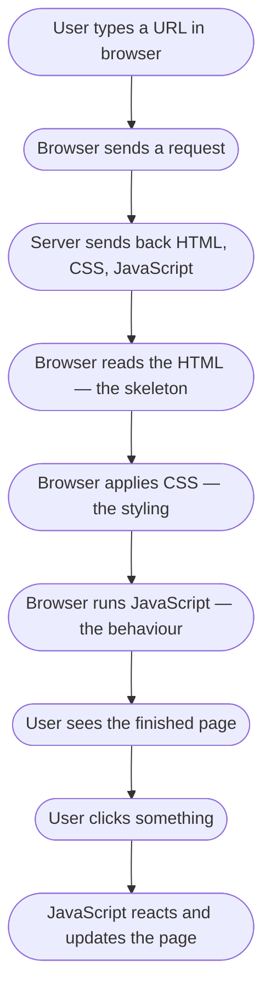
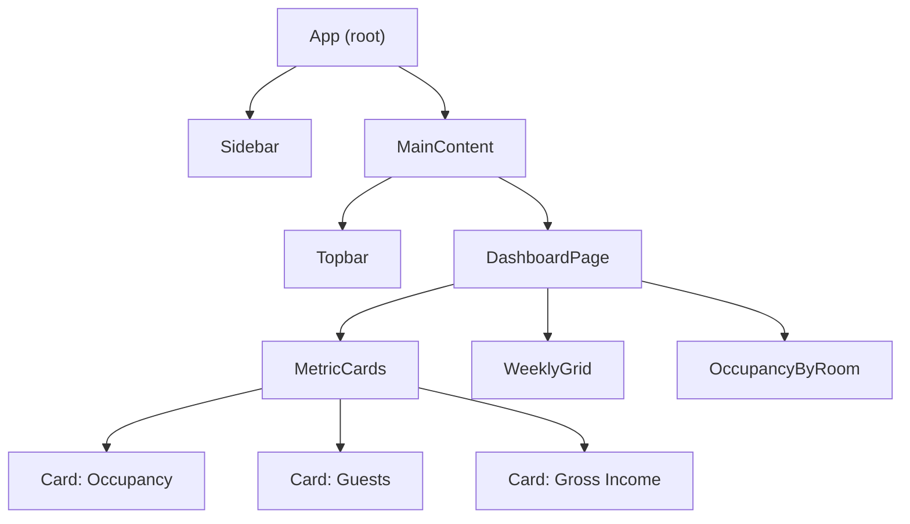
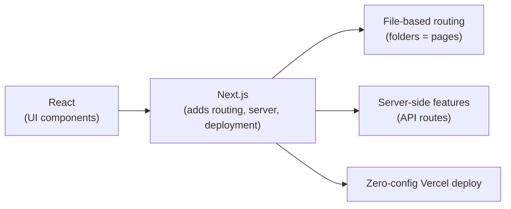
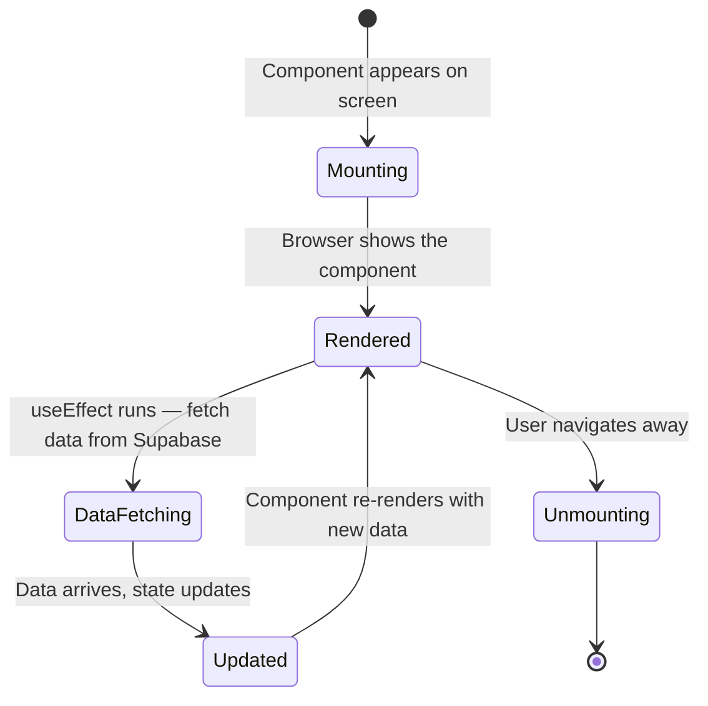
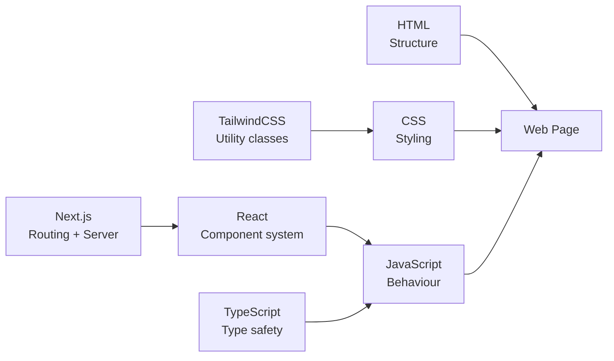

# Frontend Development — What It Is & How It Works

## What is the Frontend?

The **frontend** is everything a user sees and interacts with in their browser or on their phone screen. When you open the Himmapun Retreat app and see the dashboard, the room grid, or the booking modal — that is all frontend.

Think of it like this:
- **Frontend** = the shop window and the inside of the store
- **Backend** = the stockroom and accounting office (invisible to the customer)

---

## How a Browser Renders a Page



The three building blocks of every webpage:

| Language | Role | Analogy |
|----------|------|---------|
| **HTML** | Structure — what elements exist | The bones of a house |
| **CSS** | Styling — how things look | The paint and furniture |
| **JavaScript** | Behaviour — what happens when you interact | The electricity and plumbing |

---

## What is React?

React is a JavaScript **library** that makes building complex UIs much easier. Instead of writing raw HTML that you update manually, you write **components** — reusable building blocks.



Each box above is a **component** — a small, reusable piece of UI. This is exactly how your Himmapun app is built.

---

## What is Next.js?

Next.js is built **on top of React** and adds extra superpowers:



**File-based routing** means the folder structure IS the URL structure:

```
src/app/
├── page.tsx          → yourapp.com/
├── dashboard/
│   └── page.tsx      → yourapp.com/dashboard
├── bookings/
│   └── page.tsx      → yourapp.com/bookings
└── login/
    └── page.tsx      → yourapp.com/login
```

No extra configuration needed — just create a folder with a `page.tsx` file inside.

---

## What is TailwindCSS?

TailwindCSS lets you style things by adding short class names directly in your HTML/JSX, instead of writing separate CSS files.

**Without Tailwind (traditional CSS):**
```css
/* styles.css */
.my-button {
  background-color: #c8e84a;
  color: black;
  padding: 8px 16px;
  border-radius: 6px;
}
```
```html
<button class="my-button">Save</button>
```

**With Tailwind:**
```html
<button class="bg-accent text-black px-4 py-2 rounded-md">Save</button>
```

The classes are tiny utilities — `bg-` means background, `px-` means horizontal padding, `rounded-` means border radius.

---

## The Component Lifecycle

When a React component loads on screen, it goes through a simple lifecycle:



In your project, every page does this:
1. Show a loading state
2. Fetch data from Supabase
3. Re-render with the real data

---

## What is TypeScript?

TypeScript is JavaScript with **types**. Types tell you what kind of data a variable holds — and catch mistakes before the code even runs.

```typescript
// JavaScript — no safety net
let guests = "two";  // Bug: this should be a number
let total = guests * 500;  // Crashes at runtime

// TypeScript — caught immediately
let guests: number = "two";  // Error shown in your editor instantly
```

In your project, the `Booking` interface defines exactly what shape a booking object must have:

```typescript
interface Booking {
  id: number;
  guest: string;
  checkin: string;   // must be a string (YYYY-MM-DD)
  gross: number;     // must be a number (฿)
  // ...
}
```

If you accidentally set `gross = "five hundred"`, TypeScript will warn you before anything breaks.

---

## Key Frontend Files in Your Project

| File | What it does |
|------|-------------|
| `src/app/layout.tsx` | Wraps every page — fonts, sidebar, topbar |
| `src/app/dashboard/page.tsx` | The main dashboard page |
| `src/components/bookings/BookingModal.tsx` | The form for adding/editing bookings |
| `src/lib/helpers.ts` | Small helper functions (format dates, calculate nights) |
| `tailwind.config.ts` | Your custom colours and fonts |

---

## Summary



Frontend development is the art of turning data into something humans can look at and interact with. Everything the staff at Himmapun Retreat taps or clicks is the frontend.
