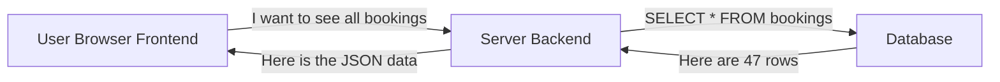
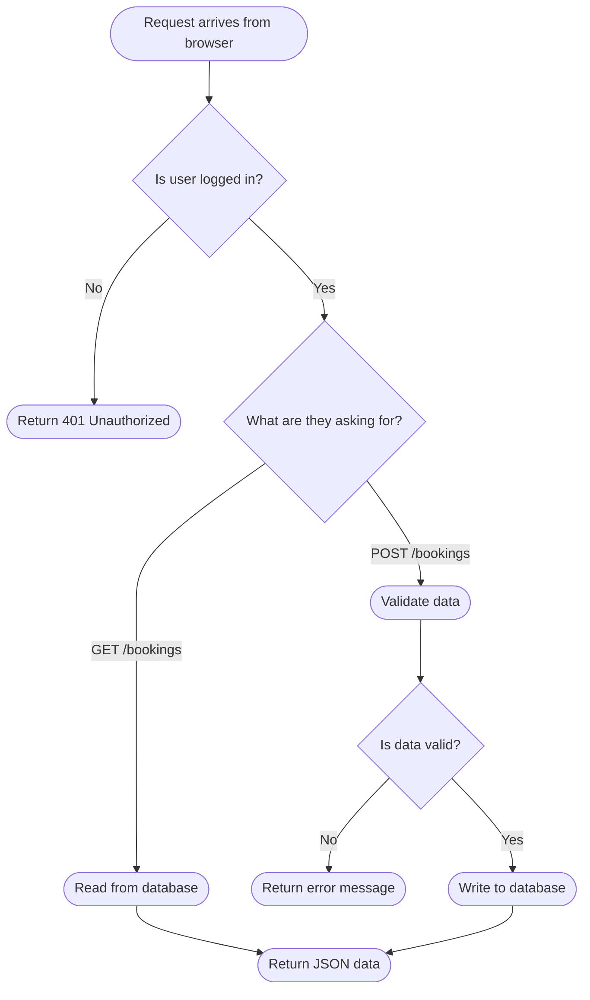
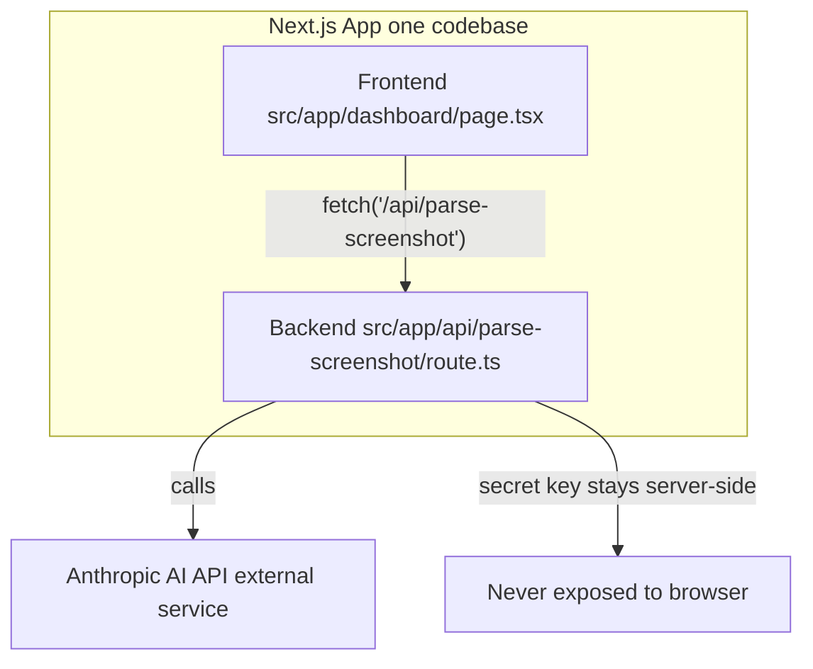
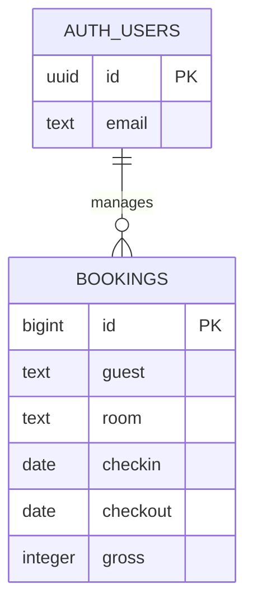
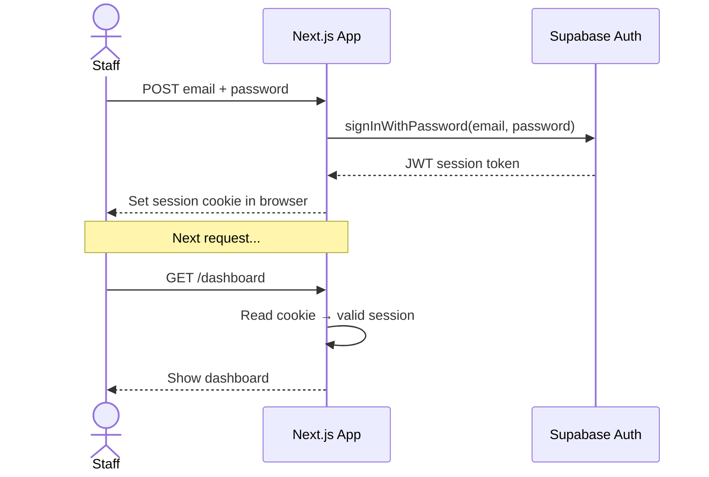
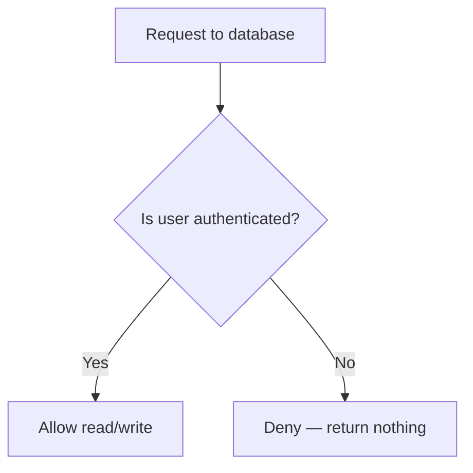
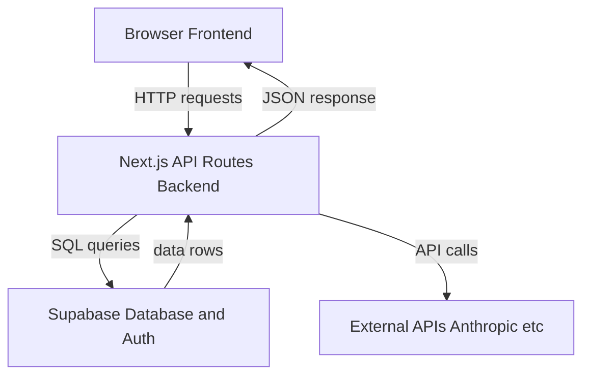

# Backend Development — What It Is & How It Works

## What is the Backend?

The **backend** is the part of a web application that runs on a server — hidden from users. It handles storing data, checking passwords, running business logic, and talking to other services.



The user never touches the database directly. The backend sits in the middle, acting as a gatekeeper.

---

## Frontend vs Backend — Side by Side

| | Frontend | Backend |
|--|----------|---------|
| **Runs on** | User's browser | A server (in the cloud) |
| **Language** | JavaScript / TypeScript | JavaScript, Python, Go, etc. |
| **Sees** | HTML, CSS, UI | Data, business logic |
| **Talks to** | The server | The database |
| **Example** | The booking form you fill in | The code that saves the booking |

---

## What Does a Backend Do?



The four most common actions a backend performs are called **CRUD**:

| Letter | Action | SQL | Example |
|--------|--------|-----|---------|
| **C** | Create | INSERT | Add a new booking |
| **R** | Read | SELECT | Fetch the booking list |
| **U** | Update | UPDATE | Change a booking's status |
| **D** | Delete | DELETE | Remove a cancelled booking |

---

## What is an API?

**API** stands for Application Programming Interface. It is a set of URLs (called **endpoints**) that the frontend can call to ask the backend to do things.

Example API endpoints for your app:

| Method | URL | What it does |
|--------|-----|-------------|
| GET | `/api/bookings` | Fetch all bookings |
| POST | `/api/bookings` | Create a new booking |
| PATCH | `/api/bookings/42` | Update booking #42 |
| DELETE | `/api/bookings/42` | Delete booking #42 |

The response comes back as **JSON** — a standard text format for data:

```json
{
  "id": 42,
  "guest": "John Smith",
  "room": "Bungalow 1",
  "checkin": "2026-03-20",
  "checkout": "2026-03-23",
  "gross": 4500,
  "status": "Upcoming"
}
```

---

## Next.js as a Backend

In your project, Next.js handles BOTH frontend AND backend in one codebase. This is called **full-stack**.



API routes in Next.js live in `src/app/api/` folders. The file `route.ts` inside handles requests.

---

## What is a Database?

A database stores data permanently. Without it, all your bookings would disappear when the server restarts.

Your project uses **PostgreSQL** (a type of relational database), hosted by Supabase.

**Relational** means data is stored in tables, like spreadsheets, and tables can relate to each other:



Every booking row is one guest stay. Every user row is one staff member who can log in.

---

## What is Authentication?

Authentication is how the app knows **who you are**. Without it, anyone could view all bookings.



A **JWT (JSON Web Token)** is like a signed stamp that proves "this person logged in and we trust them". It expires after a set time (e.g. 1 hour), after which the user must log in again.

---

## Row Level Security (RLS)

In your app, **RLS** is a database-level security rule. Even if someone somehow bypasses the app, the database itself will refuse to serve data unless the request comes from an authenticated user.



The rule in SQL looks like this:
```sql
create policy "Authenticated users only" on bookings
  for all using (auth.role() = 'authenticated');
```

This means: only logged-in users can touch the bookings table.

---

## Summary — Backend at a Glance



The backend is invisible to your staff, but it is doing all the hard work — saving bookings, checking logins, calculating totals, and keeping the data safe.
