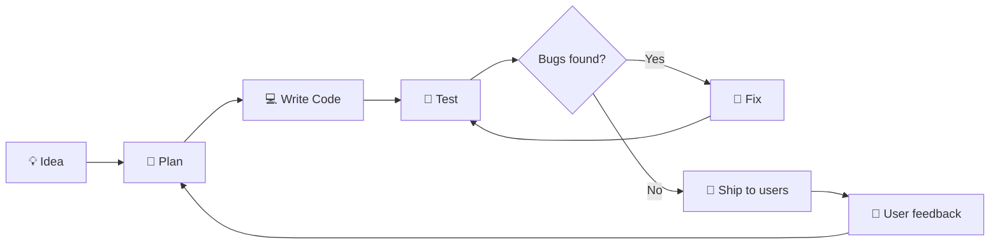
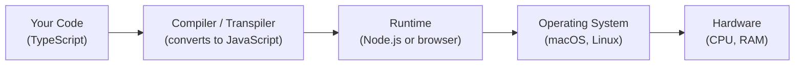
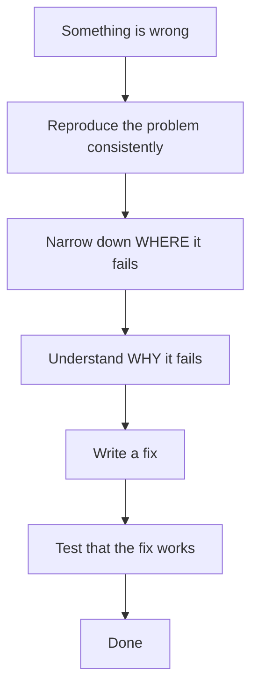
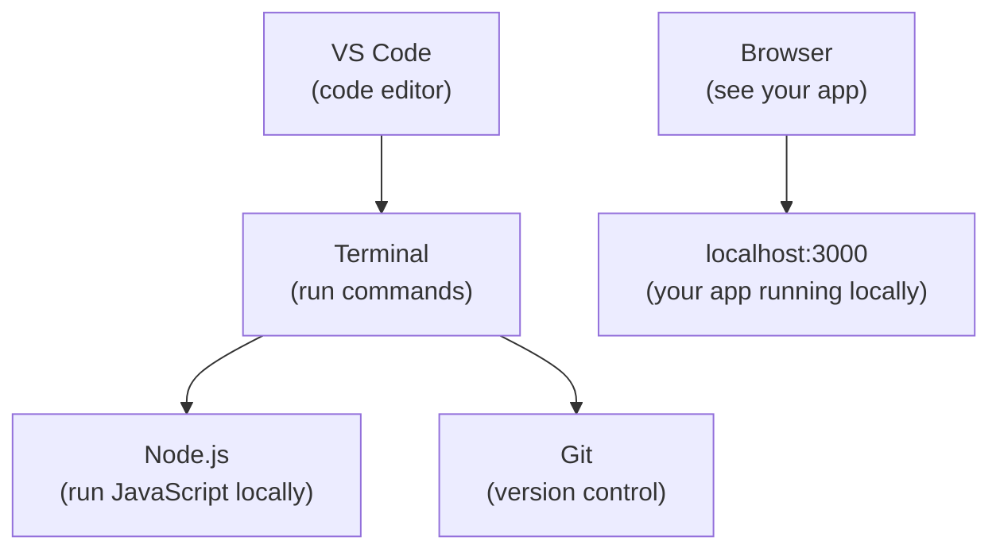
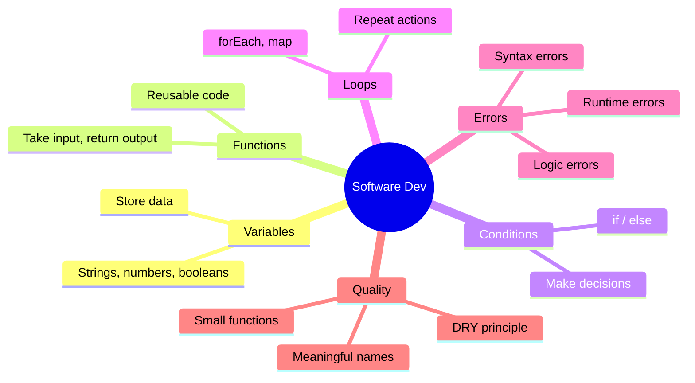

# General Software Development — Core Concepts for Beginners

## What is Software Development?

Software development is the process of turning an idea into a working program. It involves planning, writing code, testing, fixing bugs, and shipping the result to users.



Software is never truly "finished" — you build, ship, get feedback, and improve.

---

## How Code Actually Runs

When you write code, it doesn't run by itself. Something has to execute it.



- **TypeScript** is compiled to JavaScript before running
- **Node.js** runs JavaScript on a server (not in a browser)
- **The browser** runs JavaScript on the user's device

---

## Variables — Storing Information

A variable is a named container that holds a value.

```typescript
// Storing a text value (string)
let guestName = "Somchai Wongsa";

// Storing a number
let nights = 3;

// Storing true/false (boolean)
let hasTm30 = false;

// Storing a list (array)
let rooms = ["Bungalow 1", "Tent 2", "ขาว"];

// Storing structured data (object)
let booking = {
  guest: "Somchai",
  checkin: "2026-03-20",
  gross: 4500,
};
```

---

## Functions — Reusable Actions

A function is a named block of code you can run (call) whenever you need it.

```typescript
// Define the function once
function calculateNights(checkin: string, checkout: string): number {
  const start = new Date(checkin);
  const end = new Date(checkout);
  const diffMs = end.getTime() - start.getTime();
  return diffMs / (1000 * 60 * 60 * 24);  // convert milliseconds to days
}

// Call it anywhere, as many times as you want
const nights = calculateNights("2026-03-20", "2026-03-23");
// nights = 3
```

Your project uses functions like `calcNights`, `fmtDate`, and `fmtMoney` in `src/lib/helpers.ts`.

---

## Conditions — Making Decisions

Code can choose different paths based on a condition.

```typescript
// If / else
if (booking.status === "Checkout") {
  markRoomForCleaning(booking.room);
} else if (booking.status === "Check-in") {
  prepareRoom(booking.room);
} else {
  // Do nothing
}
```

```mermaid
flowchart TD
    Check{Is status "Checkout"?}
    Check -->|Yes| CleanRoom["Mark room for cleaning"]
    Check -->|No| Check2{Is status "Check-in"?}
    Check2 -->|Yes| PrepRoom["Prepare room"]
    Check2 -->|No| Nothing["Do nothing"]
```

---

## Loops — Doing Things Repeatedly

When you have a list and want to do something for each item:

```typescript
const rooms = ["Bungalow 1", "Tent 2", "ขาว"];

// For each room, print its name
rooms.forEach((room) => {
  console.log(`Room: ${room}`);
});

// Or transform the list into something new
const roomLabels = rooms.map((room) => `Room: ${room}`);
// ["Room: Bungalow 1", "Room: Tent 2", "Room: ขาว"]
```

---

## Errors & Debugging

Bugs are mistakes in code. Every developer has bugs — the skill is finding and fixing them.



**Types of errors:**

| Type | When it happens | Example |
|------|----------------|---------|
| **Syntax error** | When you write invalid code | Missing a closing bracket |
| **Runtime error** | When code runs but crashes | Trying to use `null` as an object |
| **Logic error** | Code runs but gives wrong answer | Subtracting instead of adding |

**Tools for debugging:**
- `console.log(value)` — print values to the terminal to see what they are
- Your editor (VS Code) highlights many errors before you even run code
- Browser DevTools — press F12 to see errors in the browser

---

## Reading Error Messages

Error messages look scary but they almost always tell you exactly what went wrong.

```
TypeError: Cannot read properties of undefined (reading 'guest')
    at BookingModal (BookingModal.tsx:45)
```

Reading it:
1. **TypeError** — the type of error
2. **Cannot read properties of undefined** — you tried to access `.guest` but the object was `undefined` (didn't exist yet)
3. **BookingModal.tsx:45** — file name and line number where it happened

Go to line 45, check if the booking object could be undefined before that point.

---

## Code Quality Basics

Good code is easy to read and understand later — by you, or by someone else.

**Use meaningful names:**
```typescript
// Bad
const x = checkout - checkin;

// Good
const nights = checkout - checkin;
```

**Keep functions small and focused:**
```typescript
// Bad — one function does everything
function saveBooking() {
  // 200 lines of validation + calculation + network call
}

// Good — split into focused functions
function validateBooking(booking) { ... }
function calculateDerivedFields(booking) { ... }
function insertToDatabase(booking) { ... }
```

**Don't repeat yourself (DRY):**
```typescript
// Bad — same logic in three places
if (nights < 1) return "error";
// ... 50 lines later ...
if (nights < 1) return "error";

// Good — one function, called wherever needed
function isValidNights(nights: number): boolean {
  return nights >= 1;
}
```

---

## The Development Environment

Before writing code, you need the right tools set up on your computer.



**The development loop:**
1. Run `npm run dev` in terminal → your app starts at `localhost:3000`
2. Edit code in VS Code
3. Browser refreshes automatically
4. When happy, commit changes with Git and push to GitHub → Vercel deploys automatically

---

## Summary



Every complex app is made of these simple building blocks. Start small, understand each piece, and the big picture will come together naturally.
