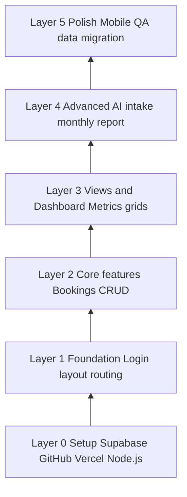
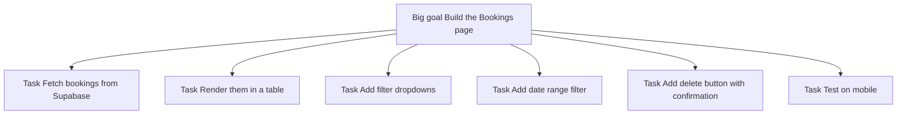
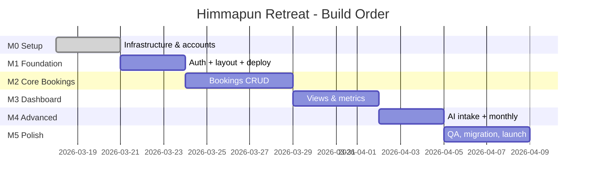
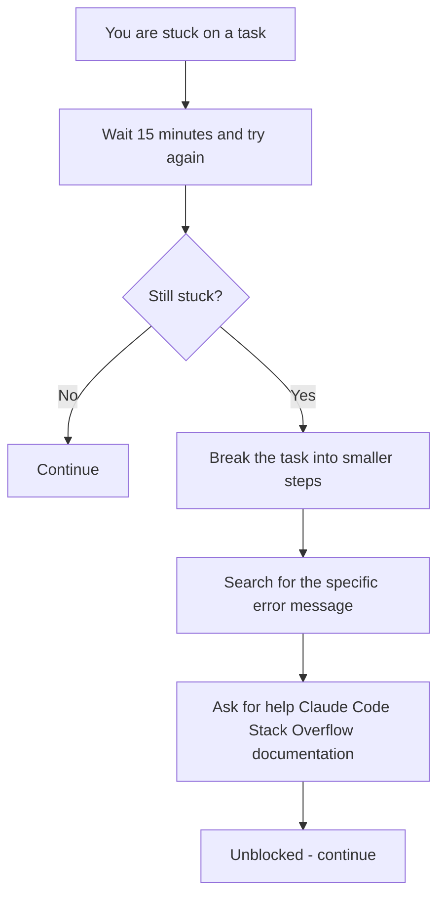
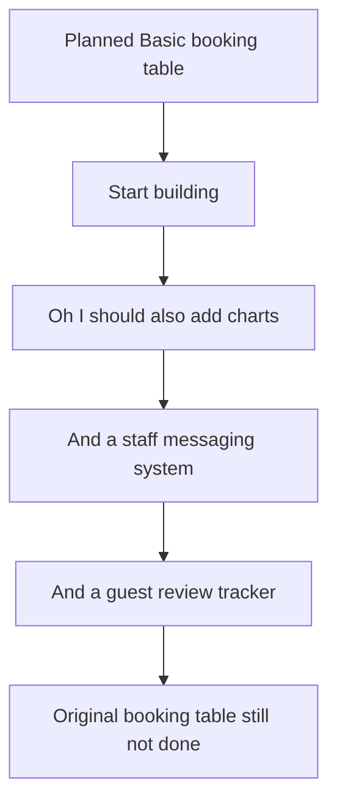
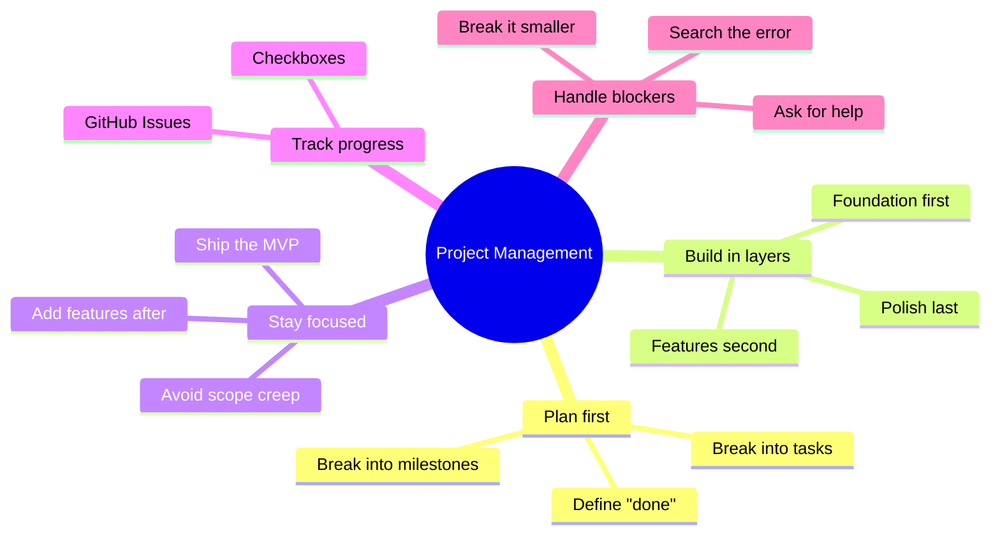

# Project Management for Software Projects - A Beginner's Guide

## What is Project Management?

Project management is how you organise your work so that you know:
- **What** needs to be built
- **In what order** to build it
- **How** to know when something is done

Without it, you will go in circles, build things in the wrong order, and forget what you were supposed to do next.

---

## The Golden Rule: Build in Layers

Do not try to build everything at once. Build a solid foundation first, then add features on top.



Your `PLANNING.md` already follows this pattern with milestones M0 → M5.

---

## Milestones vs Tasks

| Term | What it means | Example |
|------|--------------|---------|
| **Milestone** | A meaningful checkpoint - a phase of work | M2: Core Booking Features |
| **Task** | A single concrete action | "Build the + New Booking modal" |
| **Done condition** | How you know a milestone is complete | "Staff can create and edit bookings" |

A milestone is done only when its done condition is met - not just when you think you finished.

---

## How to Break Down Work

Big things feel overwhelming. Break them down until each task takes less than one day.



If a task still feels too big, break it down further. "Build the table" → "write the table header" → "write one data row" → "loop over all rows".

---

## The Milestone Plan for This Project



---

## Definition of Done

Every task should have a clear "done" condition. Vague tasks never end.

| Bad | Good |
|-----|------|
| "Work on the login page" | "Staff can log in with email/password and see the dashboard" |
| "Fix the bookings" | "Booking can be created, edited, and deleted without errors" |
| "Mobile stuff" | "All 6 pages look correct on iPhone 14 in Safari" |

---

## Tracking Your Work

You do not need complex tools. A simple list works perfectly for a solo or small team project.

**Option 1: Checkboxes in PLANNING.md** (already in your project)
```markdown
- [x] M0.1 Install Node.js
- [x] M0.2 Create Supabase project
- [ ] M1.1 Scaffold Next.js app
- [ ] M1.2 Configure Tailwind
```

**Option 2: GitHub Issues** - each task is a "ticket" you can close when done

**Option 3: A notebook** - old fashioned but it works

---

## Handling Blockers

A **blocker** is something stopping you from continuing. Do not stay stuck for hours.



The most important thing: if you are stuck, **be specific** about what you tried and what error you got. "It doesn't work" is hard to help with. "I get this error on line 42" is easy.

---

## Scope Creep - The Silent Project Killer

**Scope creep** is when you keep adding new features while the original features are not done yet.



**How to avoid it:** Write new ideas in a "Future Ideas" list and keep building what you planned. Ship the basics first.

---

## The Minimum Viable Product (MVP)

An **MVP** is the simplest version of your app that actually solves the problem.

For Himmapun Retreat:

| Feature | MVP? | Why |
|---------|------|-----|
| Login | Yes | Security - must have |
| Create/view bookings | Yes | Core purpose |
| Dashboard occupancy | Yes | Key daily view |
| Cleaning plan | Yes | Daily operations |
| AI screenshot intake | No | Nice to have, not essential |
| Monthly summary | No | Can be done in a spreadsheet for now |
| Real-time push notifications | No | Page refresh is enough |

Build and ship the MVP first. Then add more features.

---

## Communication

Even if you are building alone, write things down:
- **PLANNING.md** - decisions and architecture
- **CLAUDE.md** - rules and conventions for the codebase
- **Commit messages** - what you changed and why

Future you (or a future collaborator) will thank you for the documentation.

---

## Summary



Good project management is not about complex software or processes. It is about being clear on what needs to happen next and doing those things in the right order.
