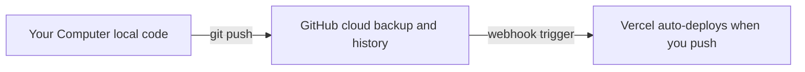
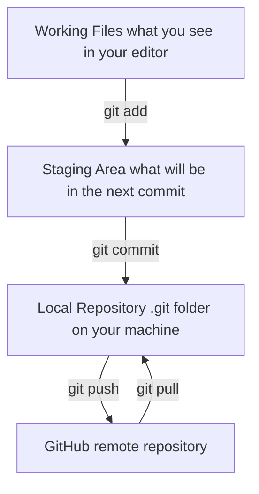
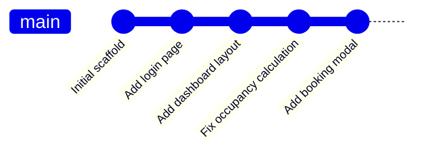
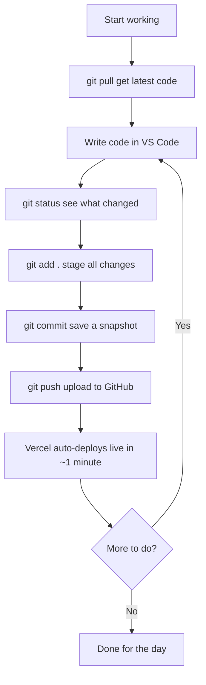
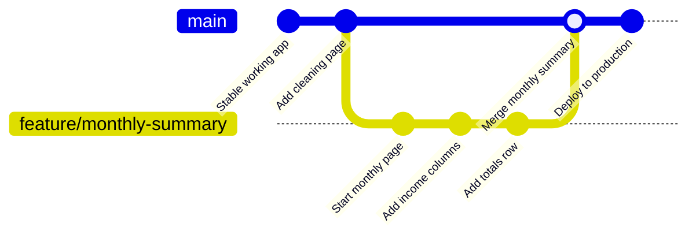
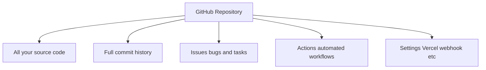

# GitHub - Version Control for Beginners

## What is GitHub?

**Git** is a tool that tracks every change you make to your code. Think of it like "Track Changes" in Microsoft Word, but for entire folders of code.

**GitHub** is a website that stores your Git history online - so your code is backed up, shareable, and can trigger other services (like Vercel deployments).



---

## Why Do You Need Version Control?

Without Git, you might:
- Accidentally delete code and have no way to get it back
- Not remember what you changed last week
- Break something and not know what caused it
- Have to email `.zip` files to collaborators

With Git:
- Every saved version is permanent and labelled
- You can go back to any point in time
- You know exactly what changed, when, and why

---

## The Core Concepts



| Command | What it does |
|---------|-------------|
| `git add filename` | Stage a file (prepare it for saving) |
| `git add .` | Stage all changed files |
| `git commit -m "message"` | Save a snapshot with a label |
| `git push` | Upload your commits to GitHub |
| `git pull` | Download new commits from GitHub |
| `git status` | See what has changed |
| `git log` | See the history of commits |

---

## What is a Commit?

A **commit** is a saved snapshot of your code at a specific moment. Think of it like a save point in a video game.



Each commit has:
- A unique ID (e.g. `6f62a37`)
- A message (what you changed)
- A timestamp (when)
- The author (who)

**Good commit messages** describe WHY you made the change, not just what:
```
Bad:  "fix stuff"
Bad:  "changed modal"
Good: "Fix checkout date not saving correctly"
Good: "Add room filter dropdown to bookings page"
```

---

## Everyday Git Workflow

Here is what your daily workflow looks like:



---

## What is a Branch?

A **branch** is a separate line of development. You use branches to work on a new feature without breaking the working code.



For a solo project like yours, working directly on `main` is perfectly fine. Branches become more important when multiple people work on the same codebase.

---

## What is a .gitignore File?

A `.gitignore` file tells Git which files to **never track**. Your project already has one.

Things that should NEVER go to GitHub:
- `.env.local` - contains secret keys (your Supabase passwords)
- `node_modules/` - thousands of files auto-installed by npm
- `.next/` - the compiled build output (can always be rebuilt)

```
# .gitignore
.env.local
.env*.local
node_modules/
.next/
```

If you accidentally commit a secret key, you must rotate (regenerate) it immediately - deleting it from the repo is not enough, because GitHub keeps the full history.

---

## The GitHub Repository

Your repository at GitHub holds:



**Repository URL pattern:** `github.com/your-username/your-repo-name`

---

## Reading the Git Log

```bash
git log --oneline
```

Output:
```
cae45f9 Add .gitignore covering .env, node_modules, Next.js build output
6f62a37 Replace in-app AI parsing with /new-booking Claude Code slash command
1af49f6 Fix Mermaid diagram syntax for broad renderer compatibility
e837272 Expand planning doc with Mermaid diagrams, user journeys, and setup guide
```

Each line = one commit. The short code on the left (`cae45f9`) is the commit ID. You can inspect any commit with `git show cae45f9`.

---

## Undoing Mistakes

| Situation | Command | What it does |
|-----------|---------|-------------|
| I staged the wrong file | `git restore --staged filename` | Unstage it |
| I want to undo my last commit (keep the changes) | `git reset HEAD~1` | Uncommit but keep edits |
| I want to see what changed | `git diff` | Show all unstaged changes |

**Important:** Never use `git reset --hard` unless you are sure - it deletes your work permanently.

---

## Summary - Git Commands Cheat Sheet

```bash
# Check what's changed
git status

# Stage all changes
git add .

# Save a commit
git commit -m "What and why you changed"

# Upload to GitHub
git push

# Download latest from GitHub
git pull

# See history
git log --oneline

# See what changed in a file
git diff filename
```

GitHub is your safety net. Commit often (several times a day), write clear messages, and push regularly so your work is never just on one machine.
