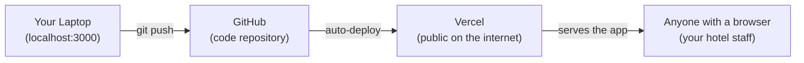
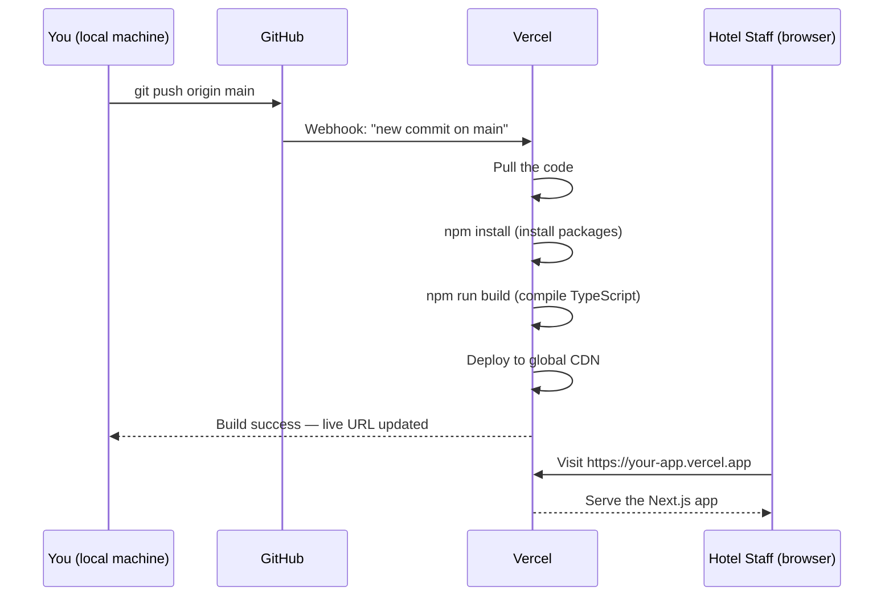
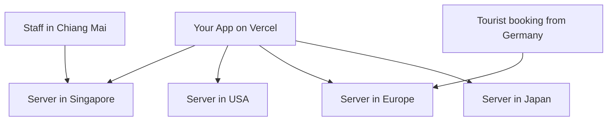
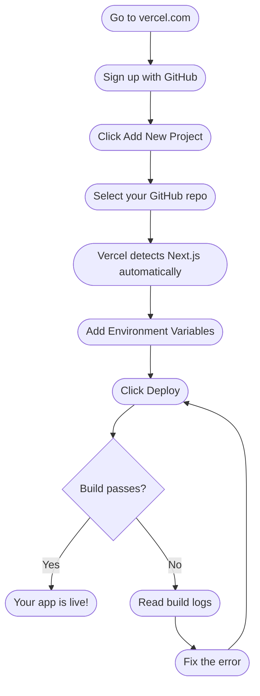
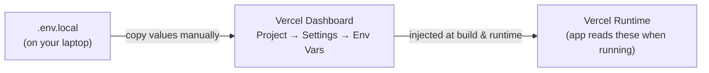
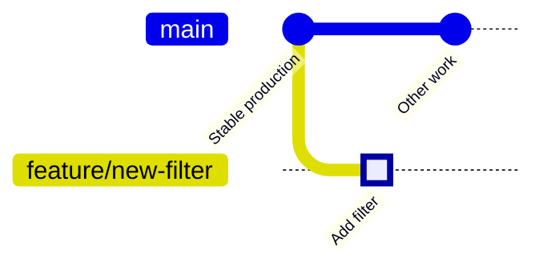
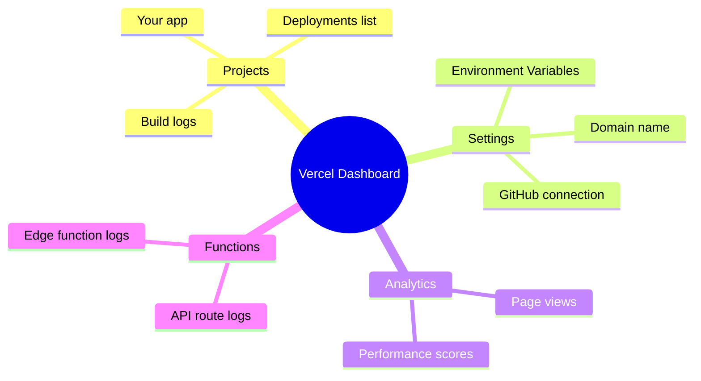
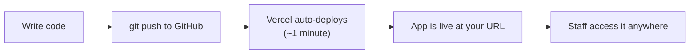

# Vercel — Hosting & Deployment for Beginners

## What is Vercel?

**Vercel** is a hosting platform that takes your Next.js code from GitHub and makes it available to anyone on the internet via a URL.

Without Vercel (or something similar), your app would only work on your own computer.



---

## Why Vercel?

| What you need | How Vercel provides it |
|---------------|----------------------|
| A public URL for your app | Automatic — `your-app.vercel.app` |
| HTTPS (secure connection) | Automatic — included for free |
| Fast loading worldwide | CDN (content delivery network) built in |
| Auto-deploy when you push | Connected to GitHub — deploys on every push |
| Zero server management | No server to set up, patch, or maintain |

Vercel is purpose-built for Next.js (the same company made both), so compatibility is seamless.

---

## The Deployment Pipeline

Here is exactly what happens when you `git push`:



The whole process takes about 1–2 minutes.

---

## What is a CDN?

**CDN** stands for Content Delivery Network. Instead of your app running on one server in one location, Vercel copies it to servers all around the world.



The user gets served by the nearest server — so the app loads fast regardless of where they are.

---

## Setting Up Vercel (Step by Step)



---

## Environment Variables on Vercel

Your app needs secret keys (like the Supabase URL and anon key) to work. On your laptop, these live in `.env.local`. On Vercel, you add them manually in the dashboard.



**What goes to Vercel:**

| Variable | Add to Vercel? | Why |
|----------|---------------|-----|
| `NEXT_PUBLIC_SUPABASE_URL` | Yes | App needs to connect to Supabase |
| `NEXT_PUBLIC_SUPABASE_ANON_KEY` | Yes | App needs to query the database |
| `SUPABASE_SERVICE_ROLE_KEY` | **No** | This is only for `/new-booking` on your laptop — never on Vercel |

**Important:** The `NEXT_PUBLIC_` prefix means the variable is safe to expose to the browser. Variables WITHOUT that prefix are server-side only.

---

## Preview Deployments

Every time you push to a branch (not just `main`), Vercel creates a **preview deployment** — a temporary URL to test your changes before they go live.



- `main` branch → `https://your-app.vercel.app` (production — what staff use)
- `feature/new-filter` branch → `https://your-app-git-feature-new-filter.vercel.app` (preview — just for testing)

---

## Reading Build Logs

When a deployment fails, Vercel shows you the build logs. Here is how to read them:

```
[00:12] npm install
[00:45] npm run build
[00:47] ▲ Next.js 15.0.0
[00:48] Creating an optimized production build...
[01:12] ✓ Compiled successfully
[01:12] Route (app)     Size
[01:12] ├ ○ /dashboard  4.2 kB
[01:12] └ ○ /bookings   3.8 kB
[01:12] ✓ Build completed
```

If there is an error:
```
[00:52] Type error: Property 'grss' does not exist on type 'Booking'
[00:52]   at src/app/dashboard/page.tsx:34
```

Go to `dashboard/page.tsx` line 34 and fix the typo (`grss` → `gross`).

---

## Vercel Dashboard Overview



The most useful pages:
1. **Deployments** — see every deploy and its status
2. **Settings → Environment Variables** — manage your secrets
3. **Build logs** — debug failed deployments

---

## Custom Domain (Optional)

By default your app is at `yourapp.vercel.app`. You can connect a custom domain (e.g. `hotel.himmapunretreat.com`) in:

Vercel Dashboard → Project → Settings → Domains → Add Domain

Then update your domain's DNS settings (at your domain registrar) to point to Vercel.

---

## Summary



Vercel removes the complexity of servers, HTTPS certificates, and deployment pipelines. You write code, push to GitHub, and it is live. That is the entire workflow.
