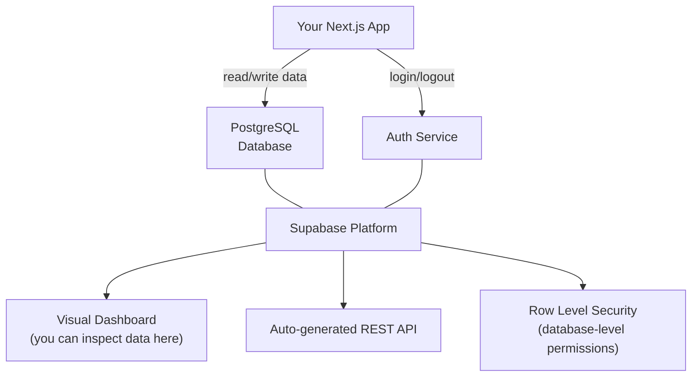
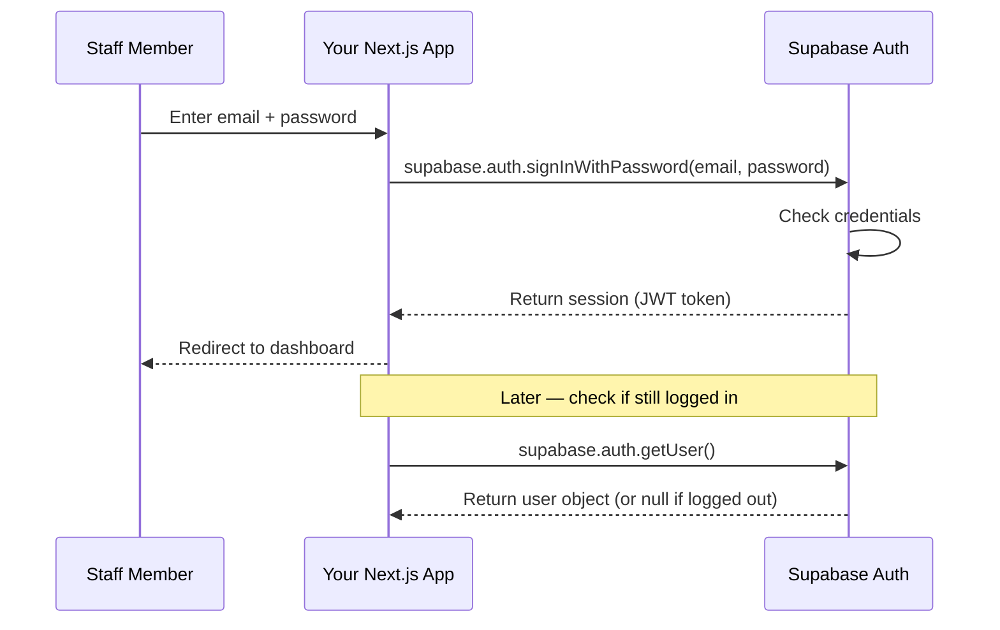
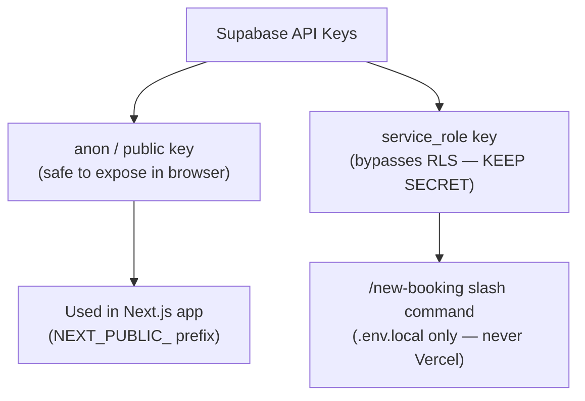
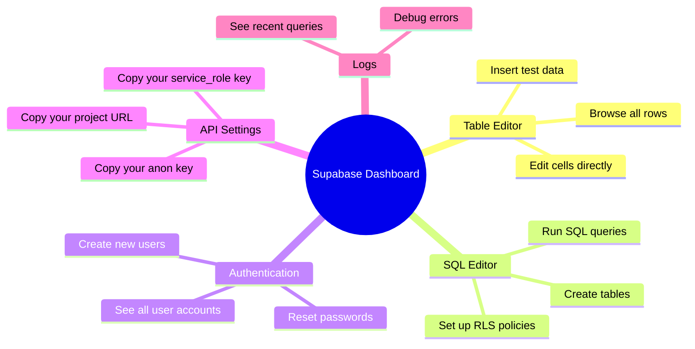
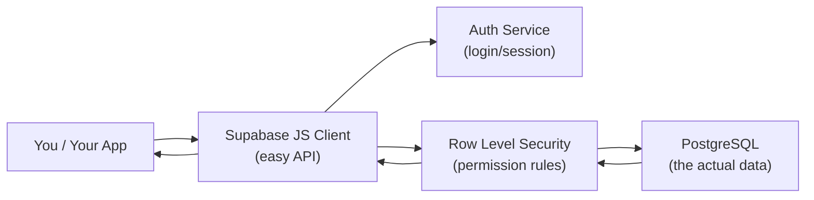

# Supabase — Database & Authentication for Beginners

## What is Supabase?

**Supabase** is a backend-as-a-service platform. Instead of setting up and managing your own database server, Supabase gives you:
- A **PostgreSQL database** (stores all your data)
- **Authentication** (handles logins securely)
- A **dashboard** (visual interface to inspect your data)
- **Auto-generated APIs** (query your data from your app)



---

## What is PostgreSQL?

PostgreSQL (often called "Postgres") is a **relational database**. Data is stored in tables — exactly like a spreadsheet, but designed for computers to read and write millions of rows very fast.

Your `bookings` table looks like this:

| id | guest | room | checkin | checkout | gross | status |
|----|-------|------|---------|----------|-------|--------|
| 1 | Somchai | Bungalow 1 | 2026-03-20 | 2026-03-23 | 4500 | Upcoming |
| 2 | Maria | Tent 2 | 2026-03-21 | 2026-03-24 | 2700 | Upcoming |
| 3 | James | ขาว | 2026-03-19 | 2026-03-20 | 1800 | Checkout |

Every **row** is one record (one booking). Every **column** is one field (guest name, room, etc.).

---

## SQL — The Language of Databases

SQL (Structured Query Language) is how you talk to a database.

**Read data:**
```sql
-- Get all bookings
SELECT * FROM bookings;

-- Get only upcoming bookings, sorted by check-in date
SELECT guest, room, checkin, gross
FROM bookings
WHERE status = 'Upcoming'
ORDER BY checkin ASC;
```

**Write data:**
```sql
-- Add a new booking
INSERT INTO bookings (guest, room, checkin, checkout, nights, gross, comm, net_income, status)
VALUES ('Somchai', 'Bungalow 1', '2026-03-20', '2026-03-23', 3, 4500, 450, 4050, 'Upcoming');

-- Update a booking's status
UPDATE bookings
SET status = 'Check-in'
WHERE id = 1;

-- Delete a booking
DELETE FROM bookings WHERE id = 1;
```

**In your Next.js app**, you use the Supabase JavaScript client instead of writing raw SQL — but the client translates your code into SQL behind the scenes.

---

## The Supabase JavaScript Client

You never write SQL directly in your React components. You use the Supabase client:

```typescript
import { createClient } from '@supabase/supabase-js';

const supabase = createClient(SUPABASE_URL, SUPABASE_ANON_KEY);

// Fetch all bookings
const { data, error } = await supabase
  .from('bookings')
  .select('*')
  .eq('status', 'Upcoming')
  .order('checkin', { ascending: true });

// Insert a new booking
const { data, error } = await supabase
  .from('bookings')
  .insert({ guest: 'Somchai', room: 'Bungalow 1', checkin: '2026-03-20', ... });

// Update a booking
const { data, error } = await supabase
  .from('bookings')
  .update({ status: 'Check-in' })
  .eq('id', 1);
```

The `.from()` → `.select()` → `.eq()` chain is much easier to read than raw SQL, but it does the same thing.

---

## Supabase Auth

Supabase Auth handles user registration, login, session tokens, and password resets — all securely.



You do not build this yourself — Supabase handles the password hashing, session management, and token security.

---

## Row Level Security (RLS)

RLS is a set of rules that live **inside the database**. Even if someone bypasses your app and calls the database directly, RLS will block them.

```mermaid
flowchart TD
    Request["Someone tries to read bookings"]
    Request --> Check{Is auth.role() = 'authenticated'?}
    Check -->|Yes — logged in user| Allow["Return the data"]
    Check -->|No — not logged in| Deny["Return nothing — access denied"]
```

In SQL:
```sql
-- Enable RLS on the table
ALTER TABLE bookings ENABLE ROW LEVEL SECURITY;

-- Allow all operations only for authenticated users
CREATE POLICY "Authenticated users only"
ON bookings
FOR ALL
USING (auth.role() = 'authenticated');
```

Once this policy is in place, anonymous requests (from someone not logged in) will always get back an empty result — not an error, just nothing.

---

## Two API Keys — Understanding the Difference

Supabase gives you two keys. They are very different:



| Key | Who uses it | What it can do | Where it lives |
|-----|------------|----------------|----------------|
| `anon` key | Your app in the browser | Read/write only if RLS allows | `.env.local` + Vercel |
| `service_role` key | Your `/new-booking` command | Bypass RLS — do anything | `.env.local` ONLY |

The `service_role` key is like a master key. Never commit it to GitHub. Never add it to Vercel.

---

## The Supabase Dashboard

The dashboard at `supabase.com` is where you manage everything visually:



You can edit data directly in the Table Editor — useful for fixing mistakes without writing code.

---

## Data Types in Postgres

When you create a table, each column has a **type** — what kind of data it holds:

| Type | Example | Used for |
|------|---------|----------|
| `text` | `"Bungalow 1"` | Names, labels, status values |
| `integer` | `4500` | Whole numbers (money in ฿) |
| `date` | `2026-03-20` | Check-in and checkout dates |
| `boolean` | `true` / `false` | TM30 flag |
| `timestamptz` | `2026-03-18 09:22:01+07` | When a row was created |
| `bigserial` | `1`, `2`, `3`... | Auto-incrementing IDs |

Using the correct type means the database enforces it — you cannot accidentally store text in a number field.

---

## Summary



Supabase is the database, the security layer, and the authentication system — all in one managed platform. You focus on writing your app; Supabase handles the infrastructure.
