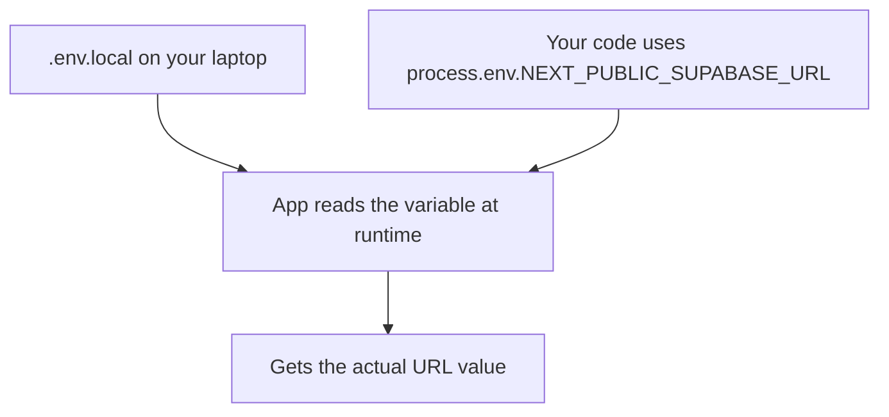
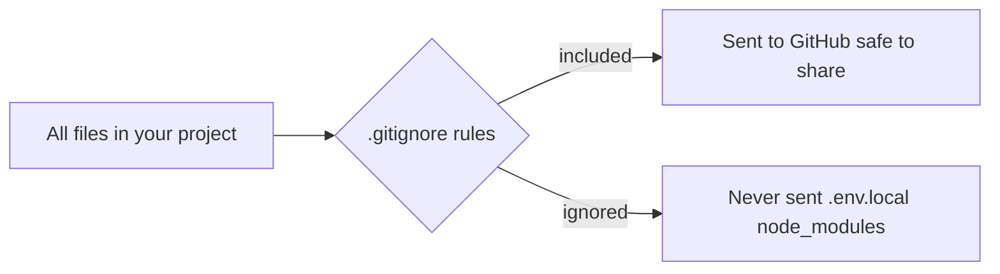
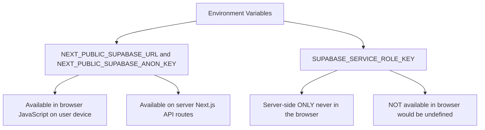
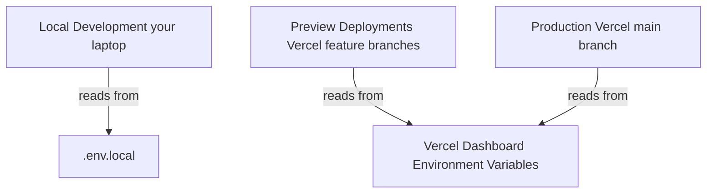
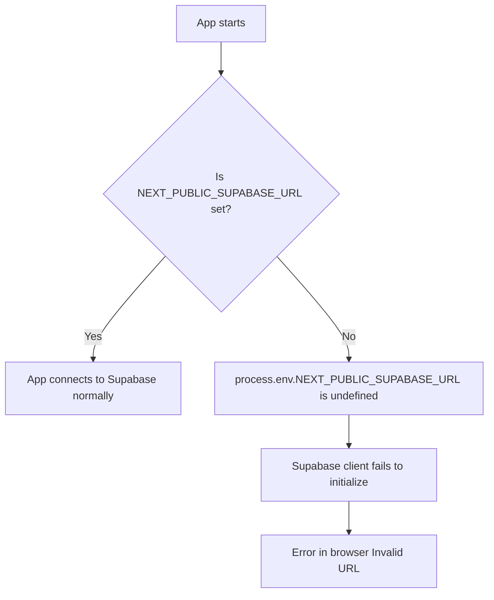
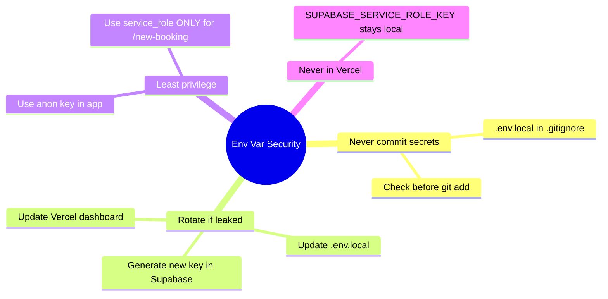

# Environment Variables — Keeping Secrets Safe

## What is an Environment Variable?

An **environment variable** is a piece of configuration that lives **outside your code**. Instead of writing your secret keys directly into your code files, you put them in a separate file that never gets shared or committed to GitHub.

Think of it like this: your code is a recipe, and the environment variable is a secret ingredient written on a separate private card. You can share the recipe, but you keep the card to yourself.

---

## Why Do You Need Them?

Imagine you wrote your Supabase password directly in your code:

```typescript
// BAD — never do this!
const supabase = createClient(
  "https://xyzxyz.supabase.co",    // hardcoded URL
  "eyJhbGciOiJIUzI1NiIsInR5cCI6IkpXVCJ9...secret_key..."  // hardcoded key!
);
```

If you push this to GitHub, **anyone in the world** can see your key, access your database, and delete all your hotel bookings.

With environment variables:
```typescript
// GOOD — key is never in the code
const supabase = createClient(
  process.env.NEXT_PUBLIC_SUPABASE_URL!,
  process.env.NEXT_PUBLIC_SUPABASE_ANON_KEY!
);
```

The actual values live in `.env.local` — a file that is never sent to GitHub.

---

## How It Works — The Flow



---

## The .env.local File

This file lives in the root of your project. It is a simple list of `KEY=VALUE` pairs.

```bash
# .env.local
NEXT_PUBLIC_SUPABASE_URL=https://xyzxyz.supabase.co
NEXT_PUBLIC_SUPABASE_ANON_KEY=eyJhbGciOiJIUzI1NiIsInR5cCI6IkpXVCJ9...
SUPABASE_SERVICE_ROLE_KEY=eyJhbGciOiJIUzI1NiIsInR5cCI6IkpXVCJ9...longer_secret...
```

Rules:
- No spaces around the `=` sign
- No quotes needed (unless the value has special characters)
- Lines starting with `#` are comments
- The file is named `.env.local` — note the dot at the start

---

## The .gitignore File — Your Safety Net

The `.gitignore` file tells Git to ignore certain files. Your `.env.local` must be in `.gitignore`:

```
# .gitignore
.env.local
.env*.local
```



Next.js adds `.env.local` to `.gitignore` automatically when you create the project.

---

## The .env.example File — The Template

Since `.env.local` is secret, how does a collaborator know which variables they need? That is what `.env.example` is for.

```bash
# .env.example — safe to commit, contains NO real values
NEXT_PUBLIC_SUPABASE_URL=
NEXT_PUBLIC_SUPABASE_ANON_KEY=
SUPABASE_SERVICE_ROLE_KEY=
```

This file IS committed to GitHub. It shows which variables are needed, without revealing the values.

**Workflow for a new team member:**
1. Clone the repo
2. Copy `.env.example` to `.env.local`
3. Fill in the actual values
4. Run the app

---

## Understanding the NEXT_PUBLIC_ Prefix

In Next.js, environment variables have different visibility depending on their name:



| Prefix | Visible in browser? | Use for |
|--------|--------------------|----|
| `NEXT_PUBLIC_` | Yes | Safe public keys (Supabase anon key) |
| (no prefix) | No | Secrets that must stay server-side |

The `SUPABASE_SERVICE_ROLE_KEY` has no `NEXT_PUBLIC_` prefix because it must never reach the browser.

---

## Where Variables Live in Each Environment

You have three "environments" — three places your app runs:



| Environment | Where variables live |
|-------------|---------------------|
| Your laptop | `.env.local` file |
| Vercel (all deploys) | Vercel Dashboard → Project → Settings → Environment Variables |

You set Vercel's variables once in the dashboard. They do not need to be committed or pushed.

---

## Your Project's Variables at a Glance

| Variable | Value source | Lives in | Purpose |
|----------|-------------|----------|---------|
| `NEXT_PUBLIC_SUPABASE_URL` | Supabase → Project Settings → API → Project URL | `.env.local` + Vercel | Connect to database |
| `NEXT_PUBLIC_SUPABASE_ANON_KEY` | Supabase → Project Settings → API → anon key | `.env.local` + Vercel | Query database (with RLS) |
| `SUPABASE_SERVICE_ROLE_KEY` | Supabase → Project Settings → API → service_role | `.env.local` ONLY | `/new-booking` command — bypasses RLS |

---

## What Happens If a Variable Is Missing?



If you see errors about "Invalid URL" or "undefined" when the app starts, a missing environment variable is usually the cause.

**How to debug:**
```typescript
// Temporarily add this to see the value
console.log("Supabase URL:", process.env.NEXT_PUBLIC_SUPABASE_URL);
```

---

## Security Checklist



---

## Summary

1. Secret values go in `.env.local` — never in code
2. `.env.local` is in `.gitignore` — never sent to GitHub
3. `.env.example` is a public template with empty values
4. `NEXT_PUBLIC_` prefix = safe for browser; no prefix = server only
5. Vercel stores its own copy of variables in the dashboard
6. If you accidentally commit a secret, regenerate it immediately

Environment variables are the single most important security habit to build as a developer.
