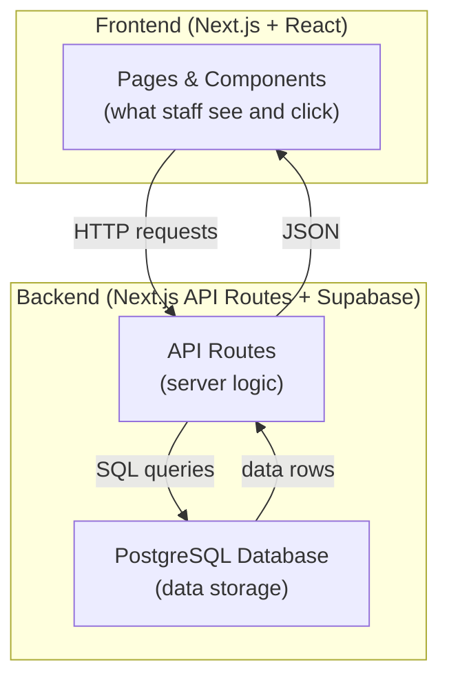
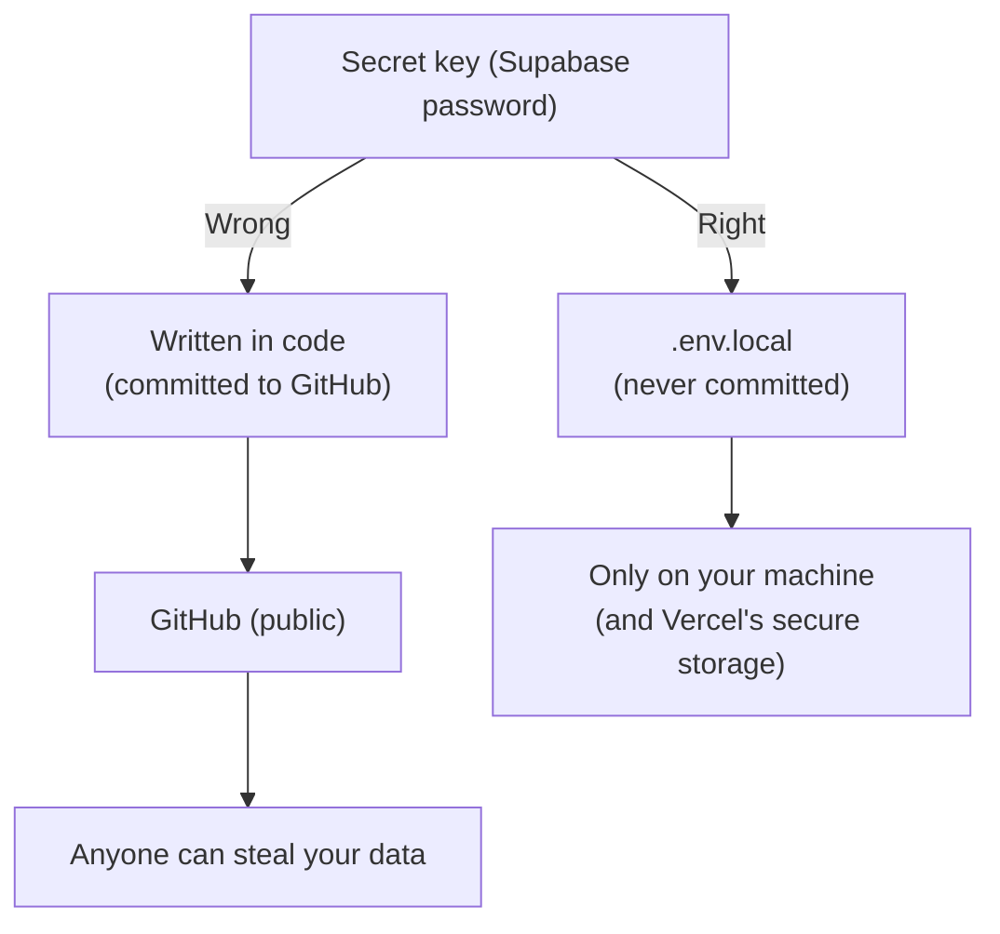
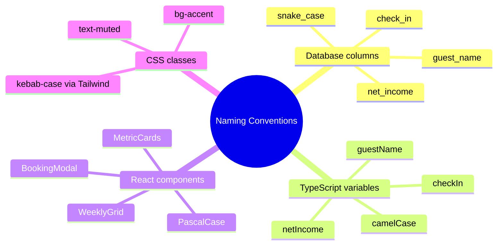
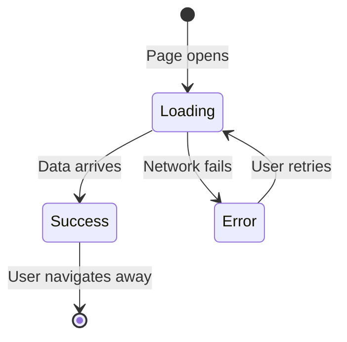
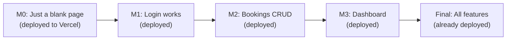
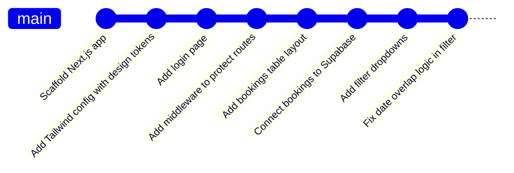
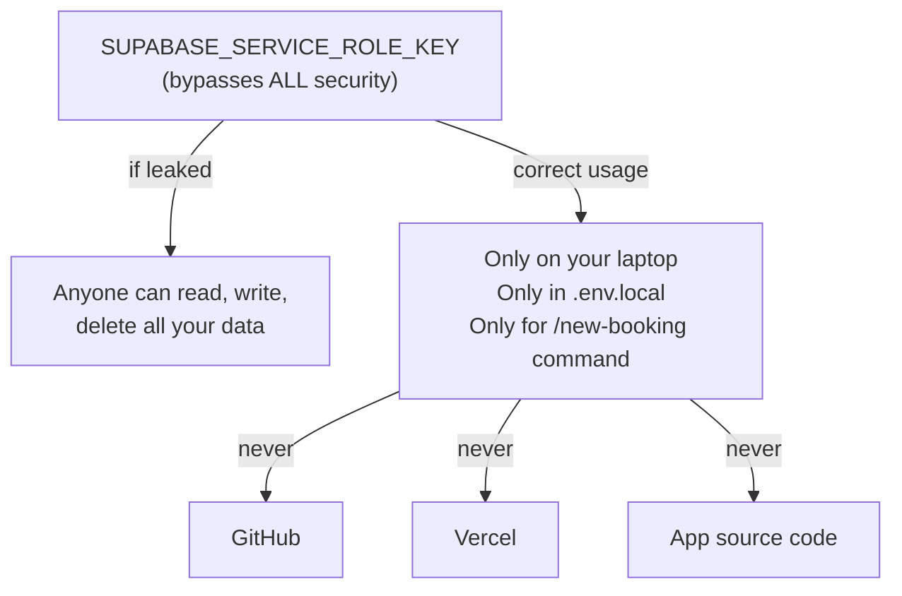
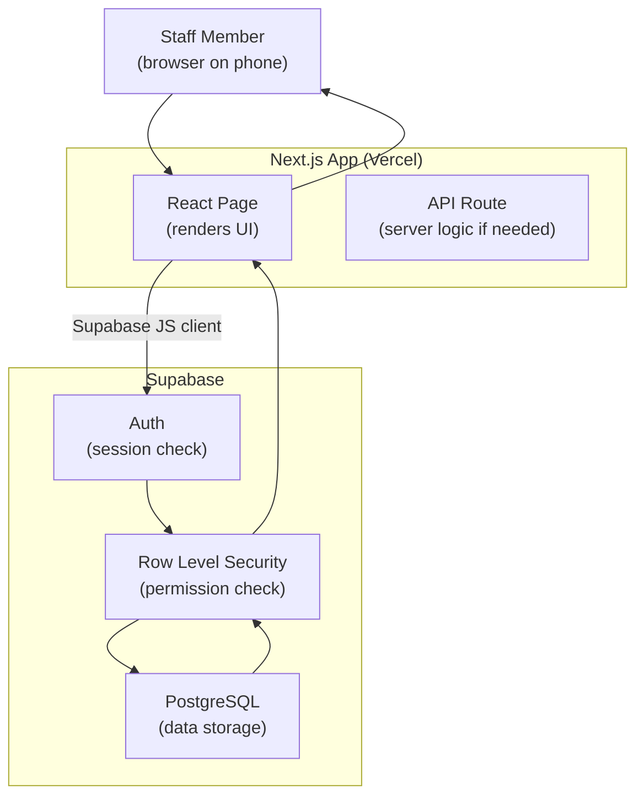

# Full Stack Best Practices — Easy Rules for a Better App

## What is a Full Stack Application?

A **full stack** app has both a frontend (what users see) and a backend (the server and database). Your Himmapun Retreat app is full stack:



Best practices are habits that make your app more reliable, secure, and easier to work on over time.

---

## Practice 1 — Never Trust User Input

**Rule:** Always validate data before saving it to the database. Users (and bugs) can send unexpected values.

```typescript
// Bad — saving whatever the user typed
await supabase.from('bookings').insert({ nights: userInput.nights });

// Good — validate first
const nights = calcNights(checkin, checkout);  // always calculate, never trust
if (nights < 1) throw new Error("Invalid dates");
await supabase.from('bookings').insert({ nights });
```

From your `CLAUDE.md`:
> "Always calculate `nights` and `net_income` in code — never trust user input for these fields"

---

## Practice 2 — Keep Secrets Out of Code



- API keys, database passwords, and service role keys go in `.env.local`
- `.env.local` is in `.gitignore`
- Check `git status` before every commit — make sure `.env.local` is not in the list

---

## Practice 3 — Calculate Derived Values in Code, Not the Form

Some values should never be entered manually — they should always be calculated:

```typescript
// From your project — derived values
const nights = calcNights(checkin, checkout);    // calculated, not entered
const netIncome = gross - comm;                  // calculated, not entered
const roomType = ROOM_TYPES[room];               // derived from room name, not entered
```

This prevents inconsistencies. If a user types "3 nights" but the dates say 4 days, which do you trust? By always calculating, there is no ambiguity.

---

## Practice 4 — Use Consistent Naming Conventions

Mixing naming styles makes code confusing and causes bugs.



Your project follows: `snake_case` in the database, `camelCase` in TypeScript, `PascalCase` for React components.

---

## Practice 5 — Write Small, Focused Functions

Each function should do **one thing**. This makes code easier to test, debug, and reuse.

```typescript
// Bad — one giant function
function handleSave() {
  // 1. Validate dates
  // 2. Calculate nights
  // 3. Calculate net income
  // 4. Derive room type
  // 5. Build the object
  // 6. Call Supabase
  // 7. Handle error
  // 8. Close modal
  // 9. Refresh the page
  // (100 lines of mixed logic)
}

// Good — small functions with single responsibilities
function validateDates(checkin: string, checkout: string): boolean { ... }
function buildBookingPayload(form: FormValues): Booking { ... }
async function saveBooking(booking: Booking): Promise<void> { ... }
function handleSave() {
  if (!validateDates(form.checkin, form.checkout)) return;
  const booking = buildBookingPayload(form);
  await saveBooking(booking);
  closeModal();
  refreshData();
}
```

---

## Practice 6 — Handle Loading and Error States

Your app fetches data from Supabase — this takes time. Always show something while waiting.

```typescript
// Three states every data-fetching component should handle
const [loading, setLoading] = useState(true);
const [error, setError] = useState<string | null>(null);
const [bookings, setBookings] = useState<Booking[]>([]);

// In the component render
if (loading) return <p>Loading...</p>;
if (error) return <p>Error: {error}</p>;
return <BookingTable bookings={bookings} />;
```



---

## Practice 7 — Use TypeScript Types for Everything

Types catch bugs before your code even runs.

```typescript
// Without types — bug-prone
function formatMoney(amount) {
  return `฿${amount.toFixed(0)}`;  // crashes if amount is a string
}

// With types — safe
function formatMoney(amount: number): string {
  return `฿${amount.toFixed(0)}`;  // TypeScript will warn if you pass a string
}

// The Booking interface means you cannot pass the wrong shape
function saveBooking(booking: Booking): Promise<void> { ... }
```

---

## Practice 8 — Keep Your Data Model Clean

From the first day, design your data to be consistent:
- Dates always as `YYYY-MM-DD` strings (never `DD/MM/YYYY` or `MM-DD-YYYY`)
- Money always as integers in ฿ (no decimals, no cents)
- Status values from a fixed list (not freeform text)

```typescript
// Good — fixed status values defined once
type BookingStatus = 'Upcoming' | 'Check-in' | 'Occupied' | 'Checkout' | 'Completed';

// Bad — freeform status anyone can type
type BookingStatus = string;  // could be "upcoming", "UPCOMING", "Upoming" (typo)
```

---

## Practice 9 — Build, Then Deploy Early

Do not wait until the app is "finished" to deploy. Deploy a skeleton on day one.



Deploying early means:
- You catch deployment errors early, not at the last minute
- Staff can see progress and give feedback
- There is no "big bang" deployment that might fail

---

## Practice 10 — Commit Often With Clear Messages



Committing often means:
- If something breaks, you can see exactly what changed
- Each commit message documents your progress
- You never lose more than a few minutes of work

---

## Practice 11 — Never Expose the Service Role Key

This deserves its own rule because the consequences are severe:



---

## The Full Stack Mental Model



---

## Quick Reference Checklist

Before you ship any feature, ask yourself:

- [ ] Is the feature working end-to-end (create, read, update, delete)?
- [ ] Are derived values calculated in code (nights, net_income)?
- [ ] Are there no hardcoded secrets in the source code?
- [ ] Does the UI show a loading state while data fetches?
- [ ] Does the UI show an error message if something goes wrong?
- [ ] Are TypeScript types correct (no `any` types)?
- [ ] Did I commit with a clear message?
- [ ] Did I test on mobile (the staff use phones)?

Follow these practices consistently and your app will be stable, secure, and a pleasure to work on.
