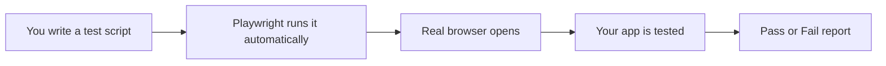
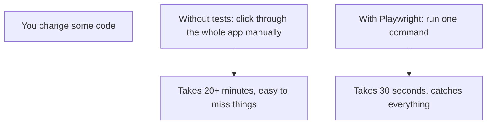
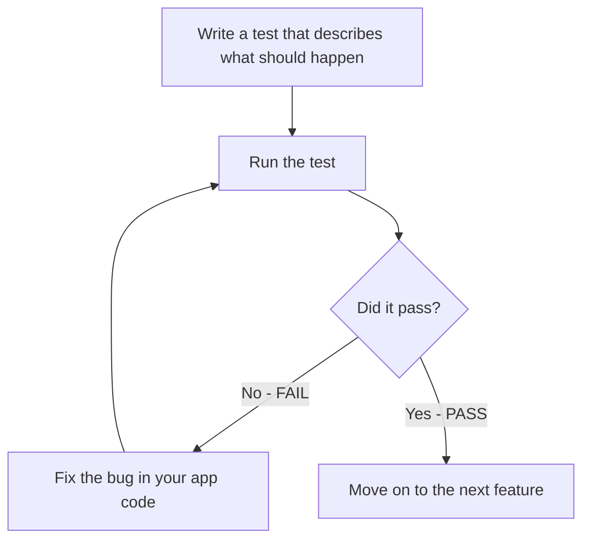
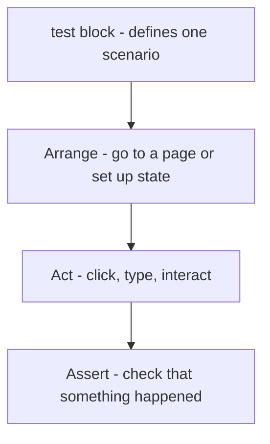
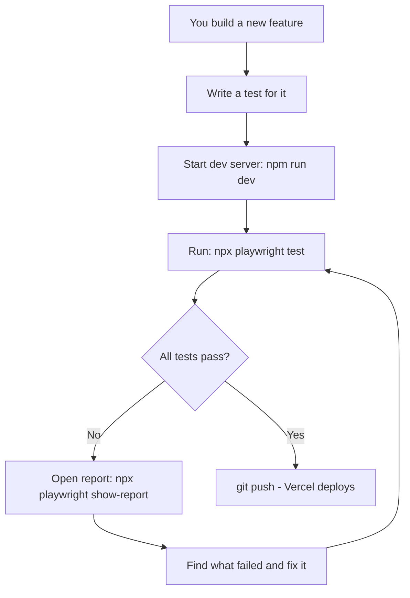

# Playwright — Automated Testing for Beginners

## What is Playwright?

**Playwright** is a tool that controls a real browser automatically — it clicks buttons, fills in forms, and checks that things appear on screen, just like a real user would. But it does this in milliseconds, and you can run it hundreds of times without any manual effort.

Think of it as a robot that tests your app for you.



---

## Why Do You Need Tests?

Without tests, every time you change something in your app you have to manually click through every page to make sure nothing broke. With Playwright tests, one command checks everything in seconds.



---

## The Testing and Validation Loop

This is the core workflow. You write a test, run it, fix the code until it passes, then move on.



This loop is called **red-green-refactor**:
- **Red** = test fails (something is broken)
- **Green** = test passes (it works)
- **Refactor** = clean up the code while keeping tests green

---

## Installing Playwright

Run this in your project terminal:

```bash
npm install --save-dev @playwright/test
npx playwright install
```

This installs Playwright and downloads the browser engines it uses (Chromium, Firefox, Safari).

Create a config file `playwright.config.ts` in your project root:

```typescript
import { defineConfig } from '@playwright/test';

export default defineConfig({
  testDir: './tests',           // where your test files live
  use: {
    baseURL: 'http://localhost:3000',   // your local dev server
    headless: true,             // true = no visible browser window (faster)
  },
});
```

---

## Your First Test

Tests live in a `tests/` folder. Each file ends in `.spec.ts`.

```
tests/
├── login.spec.ts
├── bookings.spec.ts
└── dashboard.spec.ts
```

Here is the simplest possible test — check that the login page loads:

```typescript
// tests/login.spec.ts
import { test, expect } from '@playwright/test';

test('login page loads', async ({ page }) => {
  await page.goto('/login');                          // go to /login
  await expect(page).toHaveTitle(/Himmapun/);        // page title contains "Himmapun"
  await expect(page.getByLabel('Email')).toBeVisible(); // email field is visible
  await expect(page.getByLabel('Password')).toBeVisible(); // password field is visible
});
```

Run it with:
```bash
npx playwright test
```

---

## How a Test Is Structured

Every Playwright test follows this pattern:



In code:
```typescript
test('staff can create a booking', async ({ page }) => {
  // ARRANGE — navigate to the bookings page
  await page.goto('/bookings');

  // ACT — click the New Booking button
  await page.getByRole('button', { name: 'New Booking' }).click();

  // ACT — fill in the form
  await page.getByLabel('Guest Name').fill('Somchai Wongsa');
  await page.getByLabel('Check-in').fill('2026-04-01');
  await page.getByLabel('Check-out').fill('2026-04-03');

  // ASSERT — verify the booking appears in the list
  await expect(page.getByText('Somchai Wongsa')).toBeVisible();
});
```

---

## Key Playwright Actions

| Action | What it does | Example |
|--------|-------------|---------|
| `page.goto('/path')` | Navigate to a URL | `await page.goto('/dashboard')` |
| `page.click('selector')` | Click something | `await page.click('button')` |
| `page.fill('selector', 'text')` | Type into a field | `await page.fill('#email', 'staff@hotel.com')` |
| `page.getByRole('button', { name })` | Find by role + label | `page.getByRole('button', { name: 'Save' })` |
| `page.getByLabel('text')` | Find by form label | `page.getByLabel('Guest Name')` |
| `page.getByText('text')` | Find by visible text | `page.getByText('Bungalow 1')` |
| `expect(element).toBeVisible()` | Assert it is on screen | `await expect(btn).toBeVisible()` |
| `expect(element).toHaveText('...')` | Assert text content | `await expect(cell).toHaveText('3 nights')` |
| `page.waitForURL('/path')` | Wait for navigation | `await page.waitForURL('/dashboard')` |

---

## Testing Login (Realistic Example for Your App)

```typescript
// tests/login.spec.ts
import { test, expect } from '@playwright/test';

test('staff can log in', async ({ page }) => {
  await page.goto('/login');

  await page.getByLabel('Email').fill('staff@himmapun.com');
  await page.getByLabel('Password').fill('password123');
  await page.getByRole('button', { name: 'Sign In' }).click();

  // After login, should redirect to dashboard
  await page.waitForURL('/dashboard');
  await expect(page.getByText('Dashboard')).toBeVisible();
});

test('wrong password shows error', async ({ page }) => {
  await page.goto('/login');

  await page.getByLabel('Email').fill('staff@himmapun.com');
  await page.getByLabel('Password').fill('wrongpassword');
  await page.getByRole('button', { name: 'Sign In' }).click();

  // Should stay on login page and show an error
  await expect(page.getByText('Invalid login credentials')).toBeVisible();
});

test('unauthenticated user is redirected to login', async ({ page }) => {
  await page.goto('/dashboard');

  // Middleware should redirect to /login
  await page.waitForURL('/login');
  await expect(page).toHaveURL('/login');
});
```

---

## Reusing Login Across Tests

Logging in before every single test is slow. Playwright lets you save the login session and reuse it.

```typescript
// tests/auth.setup.ts — runs once, saves session
import { test as setup } from '@playwright/test';

setup('log in as staff', async ({ page }) => {
  await page.goto('/login');
  await page.getByLabel('Email').fill('staff@himmapun.com');
  await page.getByLabel('Password').fill('password123');
  await page.getByRole('button', { name: 'Sign In' }).click();
  await page.waitForURL('/dashboard');

  // Save the session to disk — reused by all other tests
  await page.context().storageState({ path: 'tests/.auth/staff.json' });
});
```

```typescript
// playwright.config.ts — configure session reuse
export default defineConfig({
  use: {
    baseURL: 'http://localhost:3000',
    storageState: 'tests/.auth/staff.json',  // all tests start logged in
  },
  projects: [
    { name: 'setup', testMatch: /auth\.setup\.ts/ },
    {
      name: 'staff tests',
      dependencies: ['setup'],  // setup runs first
    },
  ],
});
```

Now every test starts already logged in — much faster.

---

## Testing the Dashboard

```typescript
// tests/dashboard.spec.ts
import { test, expect } from '@playwright/test';

test('dashboard shows metric cards', async ({ page }) => {
  await page.goto('/dashboard');

  await expect(page.getByText('Occupancy')).toBeVisible();
  await expect(page.getByText('Gross Income')).toBeVisible();
  await expect(page.getByText('Net Income')).toBeVisible();
});

test('dashboard shows the weekly grid', async ({ page }) => {
  await page.goto('/dashboard');

  // The 7-day grid should be present
  await expect(page.locator('.weekly-grid')).toBeVisible();
});
```

---

## Running Tests — Commands Cheat Sheet

```bash
# Run all tests
npx playwright test

# Run one specific file
npx playwright test tests/login.spec.ts

# Run in headed mode (see the browser window)
npx playwright test --headed

# Show a visual report after running
npx playwright show-report

# Run tests matching a name
npx playwright test --grep "login"
```

---

## Reading Test Results

After running tests, you see a summary:

```
Running 6 tests using 1 worker

  ✓ login.spec.ts › login page loads (1.2s)
  ✓ login.spec.ts › staff can log in (2.1s)
  ✗ login.spec.ts › wrong password shows error (1.8s)
  ✓ dashboard.spec.ts › dashboard shows metric cards (0.9s)

  3 passed, 1 failed (8.3s)
```

A `✗` means the test found a bug. Playwright also saves screenshots and a trace of what the browser did — open the report with `npx playwright show-report` to see exactly where it failed.

---

## The Validation Loop in Practice



**The rule:** never push code to GitHub until all tests pass locally.

---

## Summary

| Concept | What it means |
|---------|--------------|
| Test | A script that acts like a user and checks the result |
| Assertion | A check that something is true |
| Pass | The assertion is true — feature works |
| Fail | The assertion is false — something is broken |
| Headless | Browser runs invisibly in the background |
| Storage state | Saved login session reused across tests |

Playwright turns "I hope it still works" into "I know it works". Run the tests before every git push and you will catch bugs before your staff ever see them.
