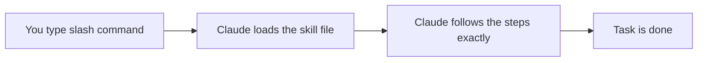
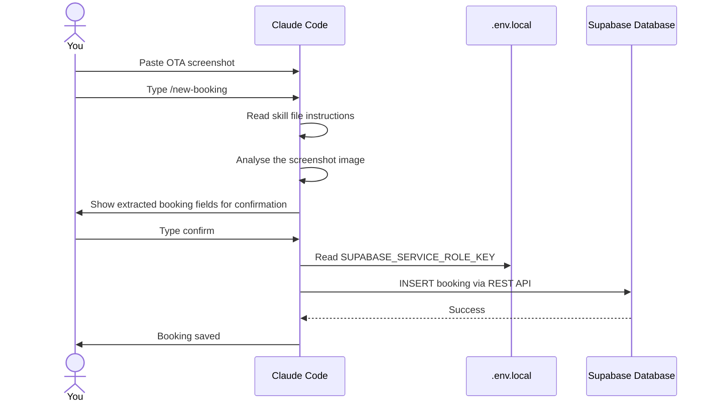
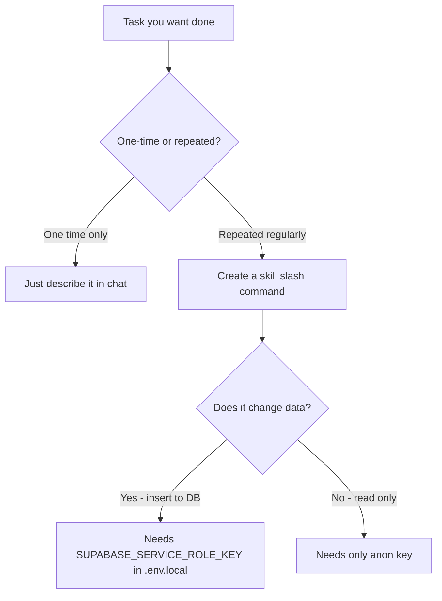
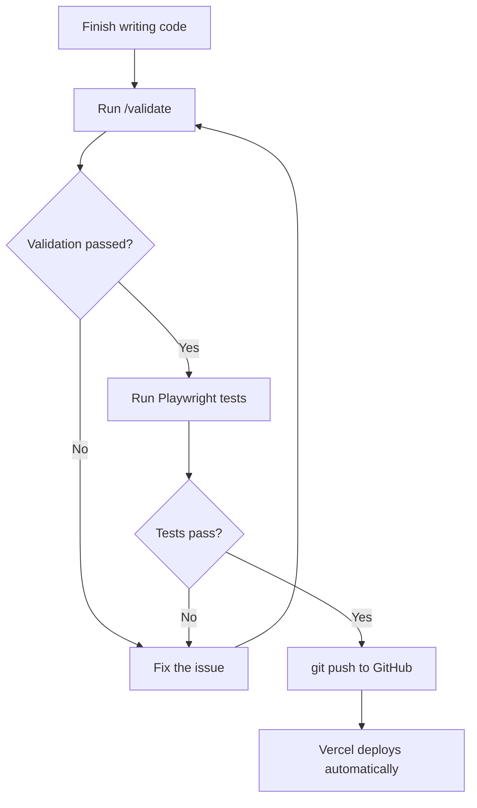

# Claude Skills - Automating Your Workflow with Slash Commands

## What is a Claude Skill?

A **skill** (also called a slash command) is a saved instruction file that tells Claude exactly what to do when you type a `/command`. Instead of typing a long instruction every time, you just type the command name and Claude follows the pre-written steps automatically.



Your project already uses one: `/new-booking` - paste a screenshot of an OTA booking, type the command, and Claude fills in and saves the booking to your database.

---

## Where Skills Live

Skills are stored as Markdown files inside the `.claude/commands/` folder in your project:

```
your-project/
└── .claude/
    └── commands/
        ├── new-booking.md      → /new-booking
        ├── validate.md         → /validate
        └── daily-check.md      → /daily-check
```

The filename (without `.md`) becomes the slash command name. The content of the file is the instruction Claude follows when you invoke it.

---

## How a Skill File is Written

A skill file is plain Markdown. It describes a task step by step, as if you were writing instructions for a very capable assistant who will follow them literally.

```markdown
# My Skill Name

Do the following steps in order:

1. Read the file `src/lib/helpers.ts`
2. Check that `calcNights` returns a positive number
3. If it looks wrong, explain the bug clearly
4. If it looks correct, say "All good"
```

That is all it takes. Claude reads the file top to bottom and follows the instructions.

---

## The /new-booking Skill (Your Existing One)

This skill is already built into your project at `.claude/commands/new-booking.md`. Here is how it works:



---

## Types of Tasks Skills Are Great For

| Task type | Example skill |
|-----------|--------------|
| Data intake | `/new-booking` - parse screenshot and insert to DB |
| Validation | `/validate` - check the app still works correctly |
| Daily checks | `/daily-check` - summarise today's bookings |
| Code review | `/review` - check a file for bugs or issues |
| Reports | `/monthly-report` - generate a summary from Supabase data |
| Setup helpers | `/setup-env` - guide through setting up .env.local |

---

## Writing Your Own Skill

### Example: /validate

This skill checks that the app is working correctly after a code change.

Create the file `.claude/commands/validate.md`:

```markdown
# Validate App

You are performing a validation check on the Himmapun Retreat hotel app.
Follow these steps in order.

## Step 1 - Check key files exist
Verify these files exist and are not empty:
- src/app/dashboard/page.tsx
- src/app/bookings/page.tsx
- src/lib/supabase/client.ts
- src/lib/constants.ts

## Step 2 - Check business rules
Read src/lib/helpers.ts and verify:
- calcNights returns checkout - checkin in days
- fmtMoney formats numbers as ฿ integers with no decimals
- isStayingOn checks: checkin <= date AND checkout > date

## Step 3 - Check constants
Read src/lib/constants.ts and verify:
- ROOMS array has exactly 12 entries
- OCC_ROOMS has exactly 10 entries (excludes Extra 1 and Extra 2)
- Every room in ROOMS has a matching entry in ROOM_TYPES

## Step 4 - Report
List any issues found. If everything looks correct, say:
"Validation passed. All checks OK."
```

Then use it anytime you want to verify the app's logic is intact:
```
/validate
```

---

### Example: /daily-check

A skill that reads today's bookings from Supabase and gives you a morning summary.

Create `.claude/commands/daily-check.md`:

```markdown
# Daily Check

Today's date is available via the currentDate context variable.

Read .env.local to get NEXT_PUBLIC_SUPABASE_URL and SUPABASE_SERVICE_ROLE_KEY.

Use the Supabase REST API to:
1. Fetch all bookings where checkin = today (status = Check-in)
2. Fetch all bookings where checkout = today (status = Checkout)
3. Fetch all bookings where status = Occupied

Then display a morning briefing:

---
## Morning Briefing - [today's date]

### Checking In Today
[list guest names, rooms, number of guests]

### Checking Out Today
[list guest names, rooms]

### Currently Occupied
[list rooms and guests]

### Rooms Needing Cleaning
[rooms from checkouts that are not yet marked Clean]
---
```

---

## Passing Information to a Skill

Some skills need input from you. You provide it by pasting content before typing the command.

**Paste then command:**
1. Paste a screenshot → then type `/new-booking`
2. Paste a CSV export → then type `/import-data`
3. Paste error text → then type `/debug`

Claude has access to everything in the conversation when the command is invoked.

---

## Skills vs Memory vs Code

It helps to understand what each tool is for:



---

## The Skill Validation Loop

A skill can be part of your testing and deployment routine:



---

## Tips for Writing Good Skills

**Be specific and sequential.** Claude follows instructions in order - write them like a numbered recipe.

**Reference real file paths.** Instead of "check the helpers", write "read `src/lib/helpers.ts`".

**Define what done looks like.** End every skill with a clear success message so you know it finished.

**Keep skills focused.** One skill = one task. Do not combine booking intake and validation into one skill - make two.

**Test the skill manually first.** Run it once and see if Claude follows the steps correctly. Adjust the instructions if not.

---

## Skill File Quick Reference

| Concept | Detail |
|---------|--------|
| Location | `.claude/commands/your-skill-name.md` |
| How to invoke | Type `/your-skill-name` in Claude Code |
| Language | Plain Markdown - no special syntax needed |
| Access to files | Claude can read any file in your project |
| Access to secrets | Via `.env.local` - Claude reads it when the skill asks |
| Access to the web | Claude can make HTTP requests if the skill instructs it |
| Access to images | Paste an image before invoking the skill |

---

## Summary

Skills are reusable, automated workflows that live in your project. They turn repetitive tasks - like adding a booking from a screenshot or validating business logic - into a single slash command. Write them once, use them forever.
