# The Claude Development Workflow - From Idea to Tested Feature

## Overview

This is the complete workflow for building software with Claude as your co-pilot. Every feature, every page, every bug fix follows the same loop.

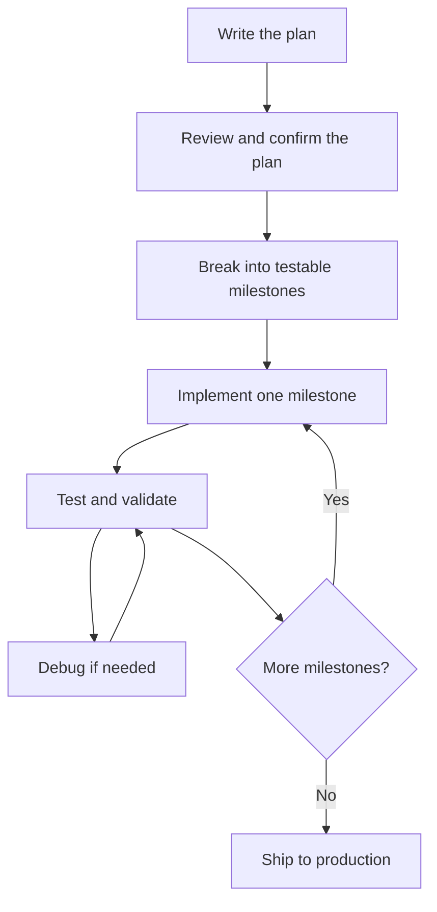

Never skip steps. The plan protects you from building the wrong thing. The tests protect you from shipping a broken thing.

---

## Step 1 - Write the Plan

Before writing a single line of code, write a planning document. This is the most important step. A good plan takes 30 minutes to write and saves you 10 hours of going in the wrong direction.

### What goes in the plan

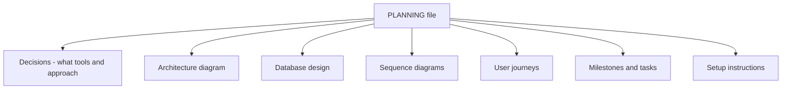

### How to write it with Claude

Open Claude Code and describe your project in plain language:

```
I want to build a hotel management app for Himmapun Retreat.
Staff need to log in, see today's bookings, add new bookings,
and track room cleaning status. Help me write a planning document
with architecture, database design, and milestones.
```

Claude will ask clarifying questions and then draft the full plan. Your job is to read it carefully and push back on anything that does not feel right.

---

## Step 2 - Diagrams in the Planning Document

Every planning document should have four types of Mermaid diagrams. They make the plan concrete and catch misunderstandings early.

### Architecture Diagram - how the pieces connect

Shows all systems and how data flows between them.

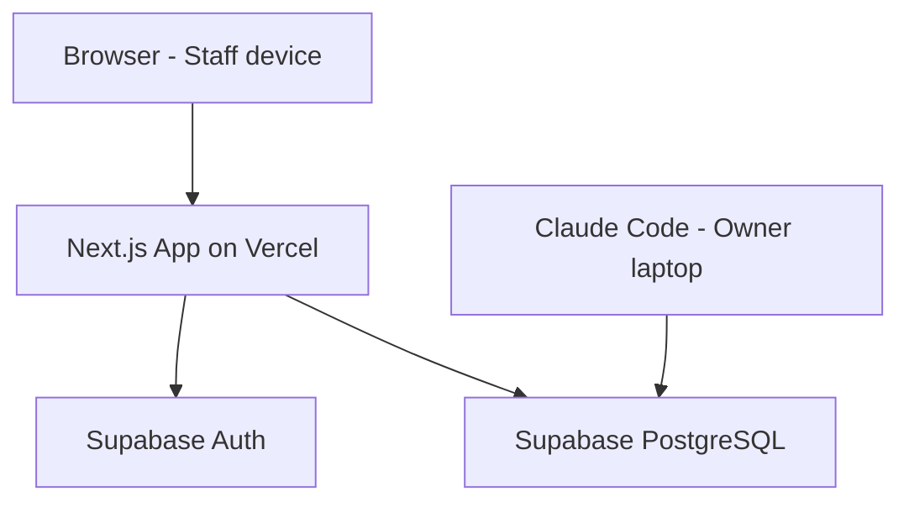

Ask Claude: *"Draw me an architecture diagram showing how the browser, Next.js, Supabase, and Vercel connect."*

---

### Sequence Diagram - how one flow works step by step

Shows the exact order of events for a single user action.

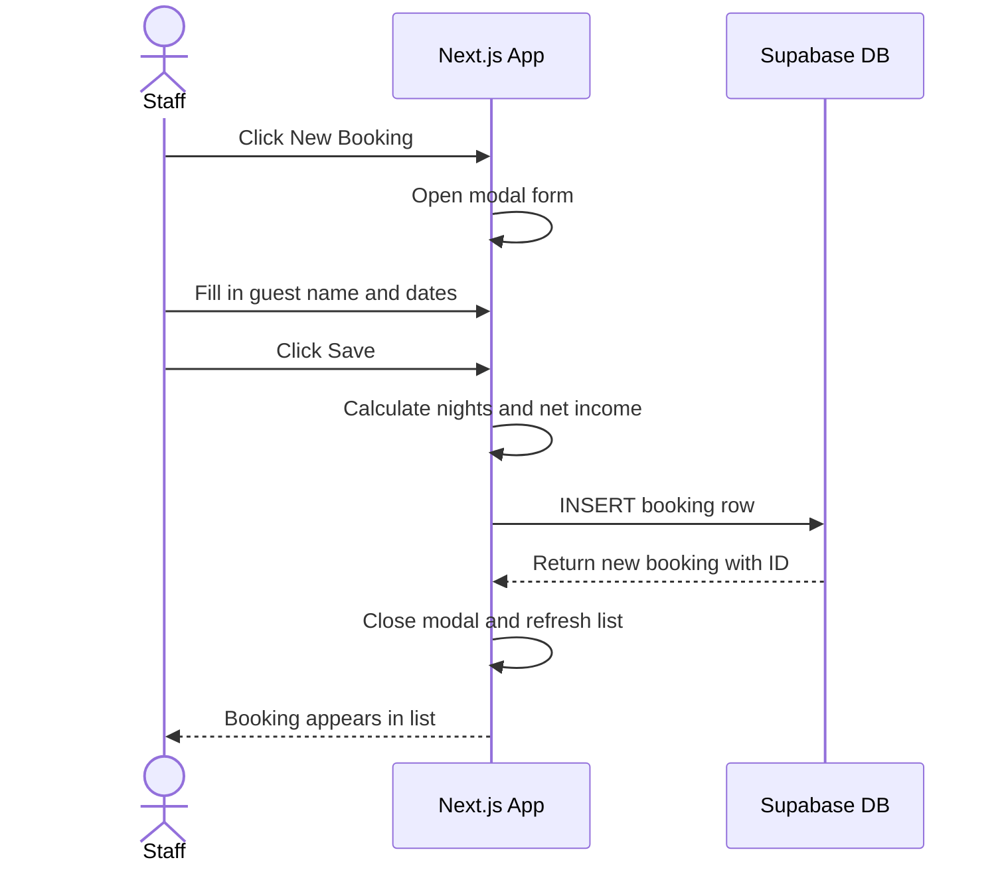

Ask Claude: *"Write a sequence diagram for the login flow"* or *"Show me the sequence for adding a booking."*

---

### Entity Relationship Diagram - the database structure

Shows what tables exist, what columns they have, and how they relate.

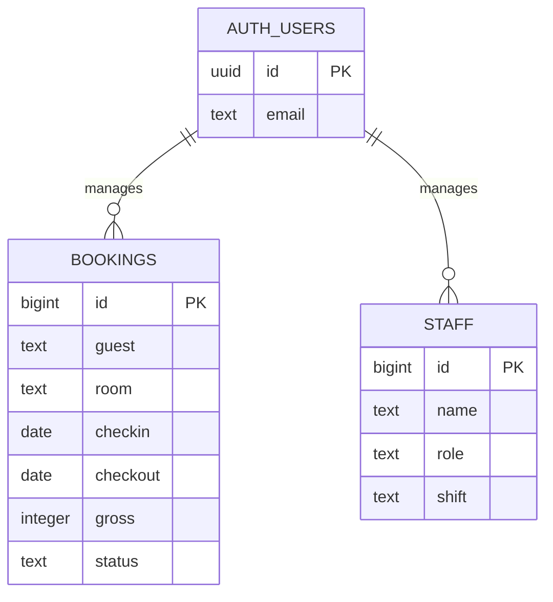

Ask Claude: *"Design the database tables for bookings, staff shifts, and monthly income. Show me an ER diagram."*

---

### User Journey - what the user actually does

Shows the steps a real person takes to complete a task.

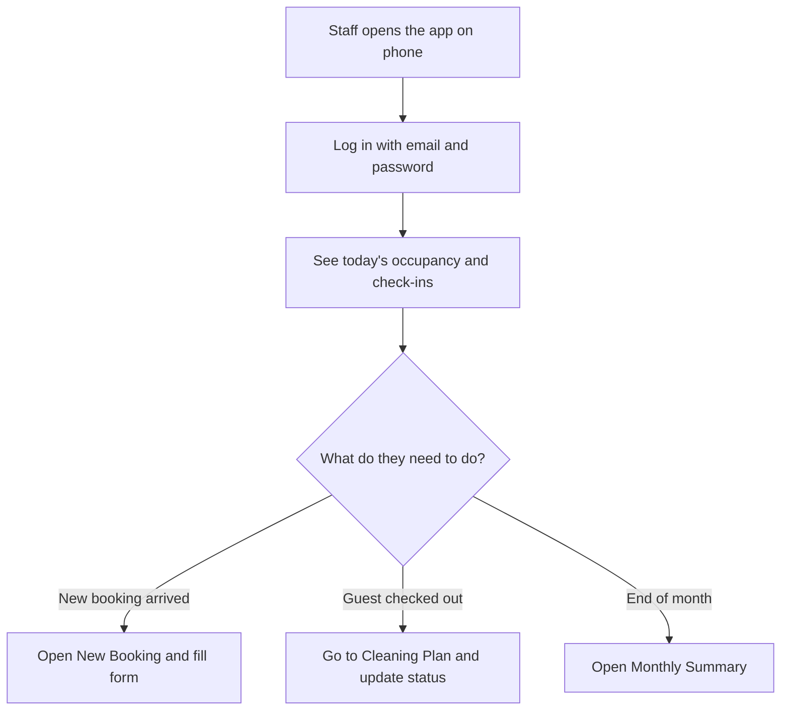

Ask Claude: *"Write user journeys for a housekeeper doing morning cleaning rounds and for the owner reviewing monthly revenue."*

---

## Step 3 - Review the Plan

Before building anything, read the plan carefully and answer these questions:

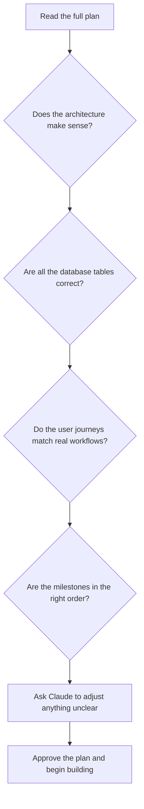

**How to push back on Claude's plan:**

```
The sequence diagram for login looks right, but in the database
design you have a "rooms" table - we don't need that because rooms
are just a fixed constant list in code, not stored in the database.
Remove it and update the ER diagram.
```

Be specific. Claude will update the plan exactly as asked.

---

## Step 4 - Create Testable Milestones

A milestone is only useful if you can verify it is done. Each milestone must have a **done condition** - a specific, observable fact that proves it works.

### Bad milestones vs good milestones

| Bad | Good |
|-----|------|
| "Work on login" | "Staff can log in with email and password and see the dashboard" |
| "Build bookings page" | "Bookings table shows all rows from Supabase with filters working" |
| "Mobile stuff" | "All 6 pages render correctly on iPhone Safari without horizontal scroll" |

### Milestone structure

Each milestone should contain:

```
### M2 - Bookings List

Goal: Staff can view, filter, and manage bookings.

Tasks:
- [ ] Fetch all bookings from Supabase on page load
- [ ] Render them in a table with all columns
- [ ] Add status filter dropdown
- [ ] Add date range filter with overlap logic
- [ ] Add delete button with confirmation

Done when:
- A booking created in Supabase appears in the list immediately on reload
- Filtering by "Upcoming" shows only upcoming bookings
- Date filter correctly includes bookings that overlap the selected range
- Deleting a booking removes it from Supabase

Claude validation command: /test milestone-2
```

### The milestone waterfall

Always build in dependency order - never start M3 before M2 is fully done and tested.

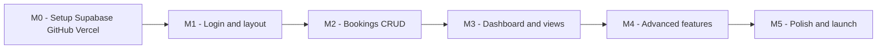

---

## Step 5 - Implement and Test Each Milestone

### The inner loop for one milestone

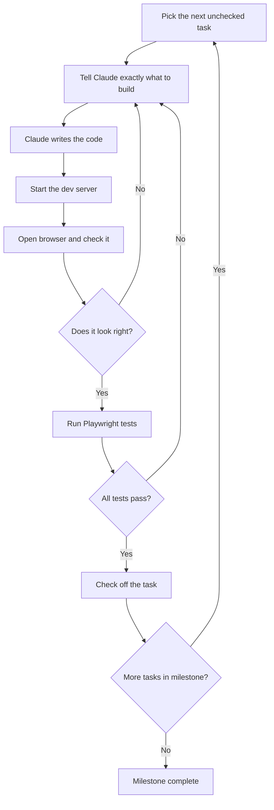

### How to tell Claude what to build

Be precise. Include the file, the behaviour, and any rules from CLAUDE.md.

**Vague (bad):**
```
Build the bookings page.
```

**Precise (good):**
```
Build src/app/bookings/page.tsx.

It should:
- Fetch all rows from the Supabase bookings table on load
- Show them in a table with columns: guest, room, checkin, checkout,
  nights, source, gross, net_income, status
- Have a status filter dropdown (Upcoming, Check-in, Occupied, Checkout, Completed, All)
- Have a date range filter using the overlap logic: checkout >= FROM AND checkin <= TO
- Show a loading spinner while data fetches
- Show an error message if Supabase returns an error

Use the ROOMS constant from src/lib/constants.ts.
Use fmtDate and fmtMoney from src/lib/helpers.ts.
Use TailwindCSS only. Follow the design tokens in CLAUDE.md.
```

The more detail you give, the less back-and-forth you need.

---

### Writing the Playwright test for the milestone

Before (or immediately after) building, write a test that proves the milestone done condition is met.

```typescript
// tests/milestone-2.spec.ts
import { test, expect } from '@playwright/test';

test('bookings page loads with data', async ({ page }) => {
  await page.goto('/bookings');
  // Table should render
  await expect(page.locator('table')).toBeVisible();
});

test('status filter works', async ({ page }) => {
  await page.goto('/bookings');
  await page.getByRole('combobox', { name: 'Status' }).selectOption('Upcoming');
  // All visible rows should show Upcoming status
  const rows = page.locator('tbody tr');
  const count = await rows.count();
  for (let i = 0; i < count; i++) {
    await expect(rows.nth(i)).toContainText('Upcoming');
  }
});

test('deleting a booking removes it from the list', async ({ page }) => {
  await page.goto('/bookings');
  const initialCount = await page.locator('tbody tr').count();
  await page.locator('tbody tr').first().getByRole('button', { name: 'Delete' }).click();
  await page.getByRole('button', { name: 'Confirm' }).click();
  await expect(page.locator('tbody tr')).toHaveCount(initialCount - 1);
});
```

Run with:
```bash
npx playwright test tests/milestone-2.spec.ts
```

---

## Step 6 - Debugging in the Loop

When a test fails or something looks wrong on screen, follow this process:

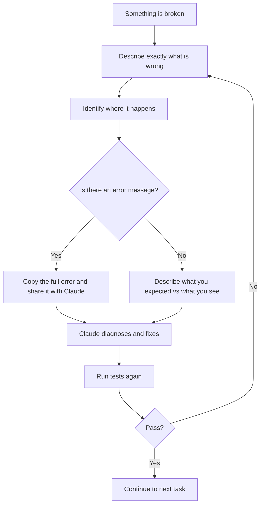

### How to share a bug with Claude

Give Claude the three pieces it needs:

```
1. WHAT I did:
   I clicked the "New Booking" button and filled in the form.

2. WHAT I expected:
   The booking should appear in the list after saving.

3. WHAT happened instead:
   The modal closed but the booking did not appear. No error visible.
   Here is the browser console error:
   TypeError: Cannot read properties of undefined (reading 'id')
   at BookingModal.tsx:87
```

Never just say "it doesn't work." That forces Claude to guess.

### Using Playwright's trace viewer to debug

When a Playwright test fails, it saves a trace automatically:

```bash
# Open the visual report to see exactly what happened
npx playwright show-report

# Run with trace enabled to capture everything
npx playwright test --trace on
```

The trace shows a timeline of every action, a screenshot at each step, and the exact moment it failed.

---

## Tips for Working Effectively with Claude

### Give Claude the right context

Claude reads your `CLAUDE.md` file automatically. Keep it up to date with:
- Business rules (occupancy denominator, how net income is calculated)
- Naming conventions (snake_case in DB, camelCase in TypeScript)
- Design tokens (colours, fonts)
- File structure

When Claude knows the rules, you do not have to repeat them every time.

---

### One task at a time

Do not ask Claude to build an entire page in one go for a complex feature. Break it into pieces:

```
Step 1: "Build the table structure and fetch data from Supabase - no filters yet"
Step 2: "Add the status filter dropdown"
Step 3: "Add the date range filter"
Step 4: "Add the delete button with confirmation modal"
```

Each step is reviewable and testable on its own.

---

### Use Claude to explain before building

If you do not understand what Claude is about to write, ask first:

```
Before you write the code, explain in simple terms how the date
overlap filter will work. I want to understand the logic.
```

Understanding the code means you can catch mistakes and maintain it later.

---

### Ask Claude to review its own work

After Claude writes code, ask it to check for problems:

```
Review what you just wrote in src/app/bookings/page.tsx.
Check for: TypeScript errors, missing error handling, business rule
violations from CLAUDE.md, and anything that would not work on mobile.
```

---

### Use the /validate skill regularly

After finishing any milestone, run `/validate` to confirm the business logic is intact. This is faster than running the full Playwright suite and catches logical mistakes early.

```
/validate
```

---

### Commit after every passing milestone

```bash
git add .
git commit -m "M2 complete: bookings list with filters and delete"
git push
```

This creates a safe restore point. If the next milestone goes badly wrong, you can always come back to this point.

---

### Use Claude to write the tests, not just the code

You do not have to write Playwright tests yourself. Ask Claude:

```
Write a Playwright test file for milestone 2.
The done conditions are:
- Bookings table loads with data
- Status filter shows only matching rows
- Date range filter uses overlap logic
- Delete button removes the booking
```

Claude will write the full `.spec.ts` file. You run it, and if it passes, the milestone is proven done.

---

## The Complete Workflow at a Glance

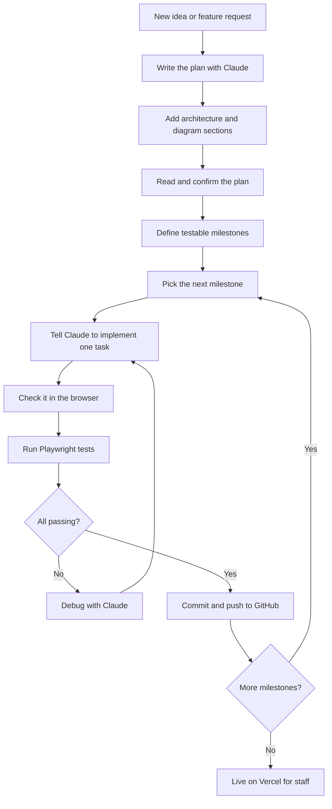

Follow this loop and you will always know exactly where you are, what works, and what needs to be built next.
